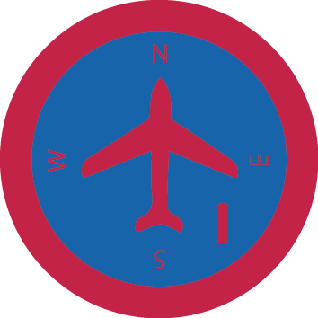

# Аеронавігація та повітряний рух І

## Спеціалізація

Летунська

## Статус

Затверджена

## Останнє оновлення інформації вмілості

2020-04-29T03:10:07.691Z

## Рівень вмілості

1 проба

## Відзначка

## Вимоги до юнацтва

<b>Аеронавігація та повітряний рух 1</b>

 

<b>1. </b>Знати основи &nbsp;повітряної навігації, пілотаж та &nbsp;політ за допомогою електронних навігаційних &nbsp;засобів.

<b> 2. </b>Знати види управління повітряним судном.

<b> 3. </b>Знати організацію &nbsp;повітряного руху (авіатраси).

<b> 4. </b>Дати визначення терміну ешелонуванню та &nbsp;причини його застосування.

 

Вмілість розробили ст.пл. Назар Костів, ст.пл.вірл. Наталя Козак і ст.пл.вірл. Христина Борщ    код на badgecraft.eu: upu_atpr1 

## Вимоги до інструкторів

Інструктор володіє вмілостями Аеронавігація та повітряний рух 1,2,3, або відповідний сертифікат.

 

## Код на badgecraft.eu

upu_atpr1