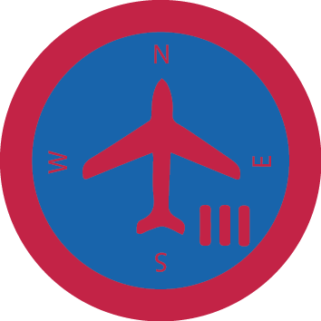

# Аеронавігація та повітряний рух ІІІ

## Спеціалізація

Летунська

## Статус

Затверджена

## Останнє оновлення інформації вмілості

2020-05-03T07:22:15.316Z

## Рівень вмілості

3 проба

## Відзначка

## Вимоги до юнацтва

<b>Аеронавігація та повітряний рух 3</b>

 

<b>1. </b>Пояснити, який вплив в летунстві мають &nbsp;атмосферний тиск, температура, вологість, хмари, &nbsp;вітри та опади. Правильно пояснити одне &nbsp;повідомлення погоди.

<b> 2. </b>Відбути хоча б одну повітряну подорож в ролі &nbsp;навігатора або помічника навігатора. Провести &nbsp;дискусію з гуртком на тему підготовки та проведення цієї подорожі. Запланувати в деталях подорож малим літаком довільного типу на віддаль не менше 160 км. За допомогою повітряних карт і летунських повідомлень про погоду подати: напрям, швидкість, вживання палива, час лету, дороговкази, стан летовищ, околиці, де є небезпечна погода і т. п.

<b> 3. </b>Назвати три види повітряних карт та пояснити символи, уживані на них.

<b> 4. </b>Перерахувати та пояснити помилки, які трапляються при користуванні альтометром, вказівником повітряної швидкості та магнетичним компасом.

<b> 5. </b>Пояснити різницю в утриманні повітряної дороги за допомогою пілотажу, обчислення віддалі від останнього знаного пункту, радіо.

<b> 6. </b>Правильно застосовувати передавач та виявити знання закликів і відповідей при небезпеці.

<b> 7. </b>Пояснити потребу і дію жароінструментів при леті.

&nbsp;

Вмілість розробили ст.пл. Назар Костів, ст.пл.вірл. Наталя Козак і ст.пл.вірл. Христина Борщ    код на badgecraft.eu: upu_atpr3 

## Вимоги до інструкторів

Інструктор володіє вмілостями Аеронавігація та повітряний рух 1,2,3, або відповідний сертифікат.

## Код на badgecraft.eu

upu_atpr3