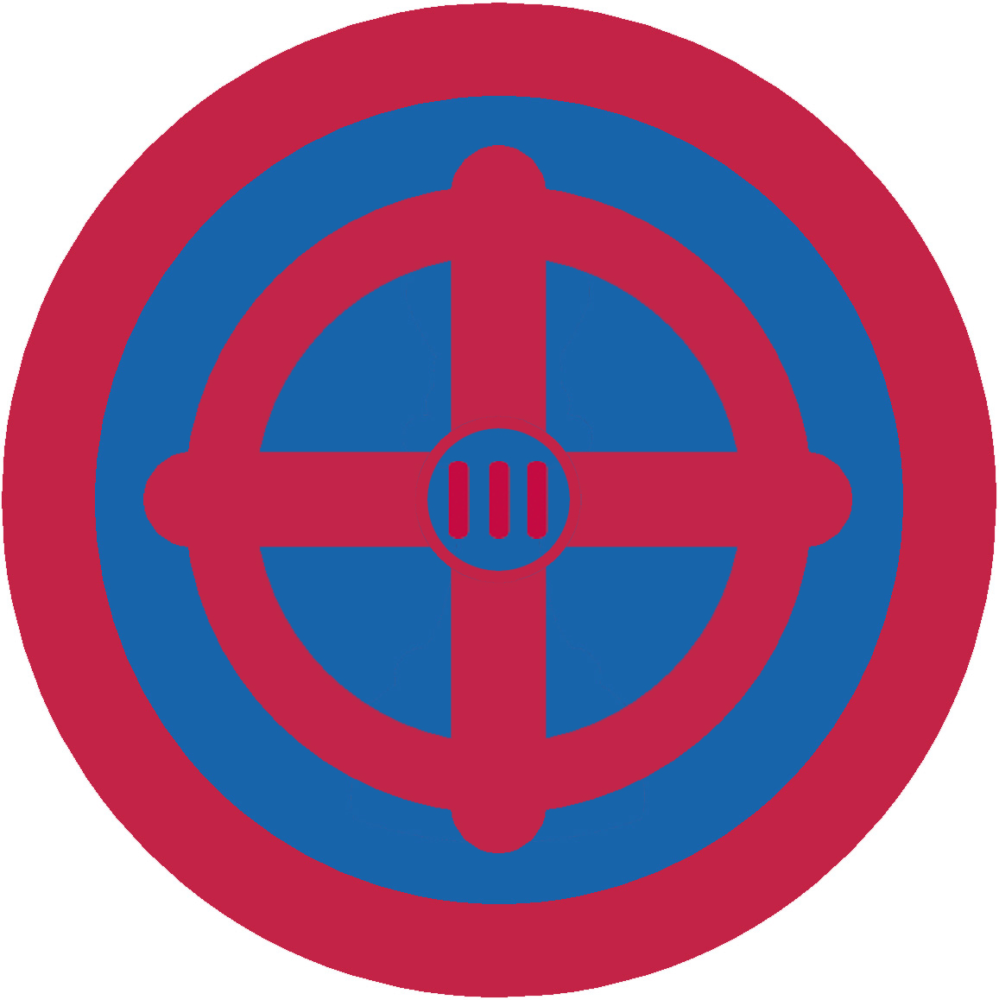

# Археологія ІІІ

## Спеціалізація

Загальні вмілості

## Статус

Затверджена

## Останнє оновлення інформації вмілості

2020-05-08T05:23:46.253Z

## Рівень вмілості

3 проба

## Відзначка

## Вимоги до юнацтва

  <ol><li>Здобути вмілість Археологія ІІ.</li><li>Здобути вмілість Картографія.</li><li>Взяти участь в 1 археологічному таборі, в часі якого відповісти наступним вимогам: – показати своє вміння користуватися нівеліром, теодолітом; – накреслити план розкопу; – знати умовні позначення, що використовуються в археології; – замалювати стратиграфію однієї з стінок розкопу; – зробити фотофіксацію 1 об’єкту та 5 знахідок;</li><li>Знати як складається список знахідок, взяти участь у складанні такого списку.</li></ol>   код на badgecraft.eu: upu_arheolog3 

## Вимоги до інструкторів

Даний розділ ще не є заповнений інформацією!

## Код на badgecraft.eu

upu_arheolog3