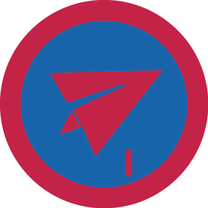

# Авіамоделювання I

## Спеціалізація

Летунська

## Статус

Затверджена

## Останнє оновлення інформації вмілості

2020-04-29T03:14:43.362Z

## Рівень вмілості

1 проба

## Відзначка

## Вимоги до юнацтва

<b>Авіамоделювання 1 </b> 

<b>1.</b> Знає що таке авіамоделювання? Пояснить в &nbsp;чому &nbsp;переваги і недоліки авіамоделювання порівняно з &nbsp;іншими видами моделювань?&nbsp; 

<b> 2.</b> Знає класифікацію авіамоделей.

<b> 3.</b> Знає які є способи керування авіамоделями.

<b> 4.</b> Проведе для свого гуртка гутірку на тему : «Першa авіамодель»

<b> 5.</b> Створить свою першу авіамодель (з пінопласту чи паперу).

 

Вмілість розробив ст.пл. Володя Максимчук, ЧоК    код на badgecraft.eu: upu_aviamodel1 

## Вимоги до інструкторів

Інструктор володіє вмілостями Авіамоделювання 1,2,3, або має відповідний сертифікат.

## Код на badgecraft.eu

upu_aviamodel1