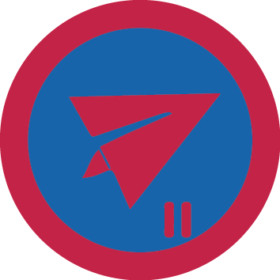

# Авіамоделювання II

## Спеціалізація

Летунська

## Статус

Затверджена

## Останнє оновлення інформації вмілості

2020-04-29T03:14:59.967Z

## Рівень вмілості

2 проба

## Відзначка

## Вимоги до юнацтва

<b>Авіамоделювання 2</b>

<b> </b>

<b>1.</b> Здобуде вмілість «Авіамоделювання 1».  

<b>2.</b> Знає яка є бортова апаратура та принципи її &nbsp;роботи.

<b> 3.</b> Поясніть роботу передавача і приймача.

<b> 4. </b>Створить 2 моделі літаків з різного матеріалу.

<b> 5. </b>Пояснить за якими принципами слід обирати місце для польотів.

<b> 6. </b>Здійснить тренувальний політ на авіасимуляторі (зліт, маршрут, посадка).

<b> </b>

Вмілість розробив ст.пл. Володя Максимчук, ЧоК    код на badgecraft.eu: upu_aviamodel2 

## Вимоги до інструкторів

Інструктор володіє вмілостями Авіамоделювання 1,2,3, або має відповідний сертифікат.

## Код на badgecraft.eu

upu_aviamodel2