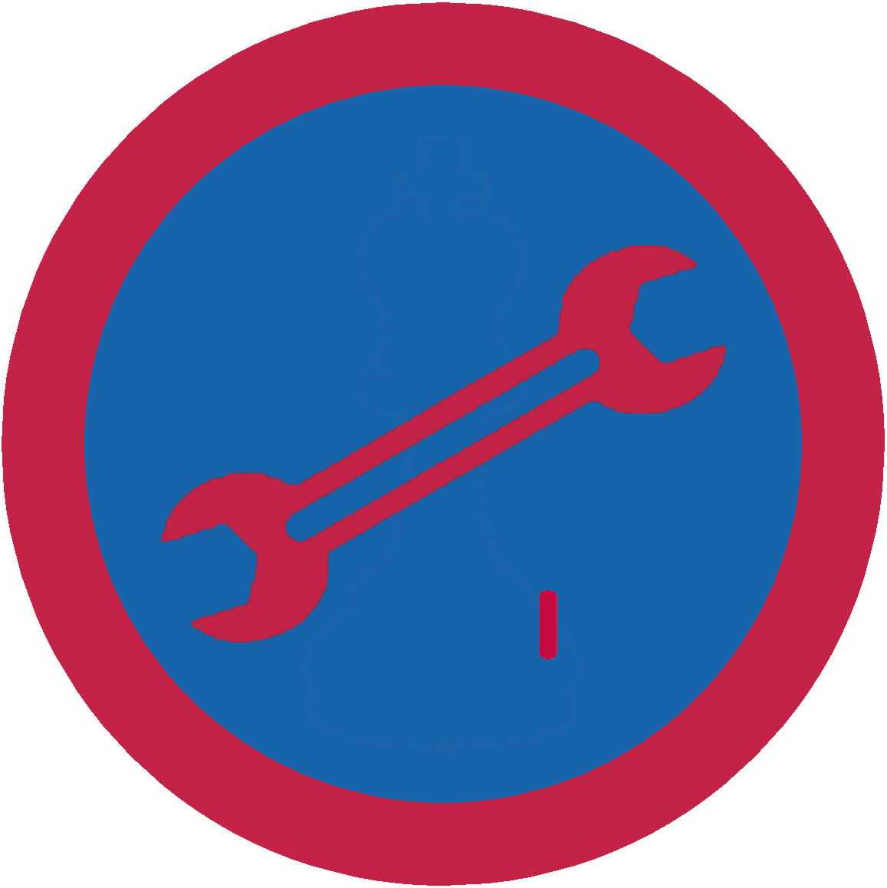

# Автознавство І

## Спеціалізація

Загальні вмілості

## Статус

Затверджена

## Останнє оновлення інформації вмілості

2020-04-29T03:11:26.285Z

## Рівень вмілості

1 проба

## Відзначка

## Вимоги до юнацтва

  

1. Знати на вигляд всі вітчизняні моделі легкових та вантажних
авт.

2. Знати напам'ять і намалювати розміщення основних
автомагістралей в Україні.

3. Бути читачем одного з періодичних українських видань для
автолюбителя.

4. Слідкувати за ходом змагань автомобілістів на світовому та українському
рівні.    код на badgecraft.eu: upu_avtozn1 

## Вимоги до інструкторів

Даний розділ ще не є заповнений інформацією!

## Код на badgecraft.eu

upu_avtozn1