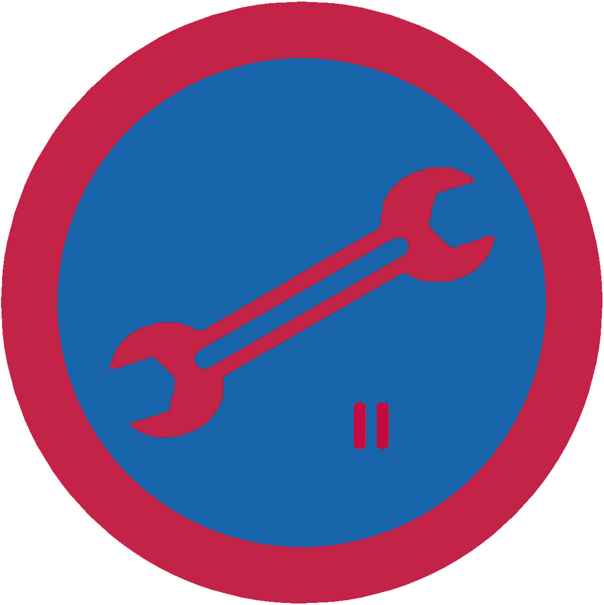

# Автознавство ІІ

## Спеціалізація

Загальні вмілості

## Статус

Затверджена

## Останнє оновлення інформації вмілості

2020-04-29T03:12:09.682Z

## Рівень вмілості

2 проба

## Відзначка

## Вимоги до юнацтва

 

1. Пояснити будову, принцип дії дизельного та бензинового
двигунів.

2. Розповісти про порядок роботи системи запалення.

3. Вправно замінити колесо в авті, розбортувати його і залатати
камеру.

4. Вміти доглядати за акумуляторною батареєю.

5. Пояснити будову системи охолодження двигуна.

6. Виміряти рівень оливи в двигуні, швидкісній скриньці,
замінити оливу при потребі.

7. Виміряти рівень гальмівної рідини в системі.

8. Знати, як загасити пожежу в авті та біля нього.

9. Замінити при потребі свічку запалення та виявити замикання
мережі.

10. Замінити гальмівні колодки у передньому та задньому приводі
коліс.

11. Правильно підготувати авто до буксирування та провести його.    код на badgecraft.eu: upu_avtozn2 

## Вимоги до інструкторів

Даний розділ ще не є заповнений інформацією!

## Код на badgecraft.eu

upu_avtozn2