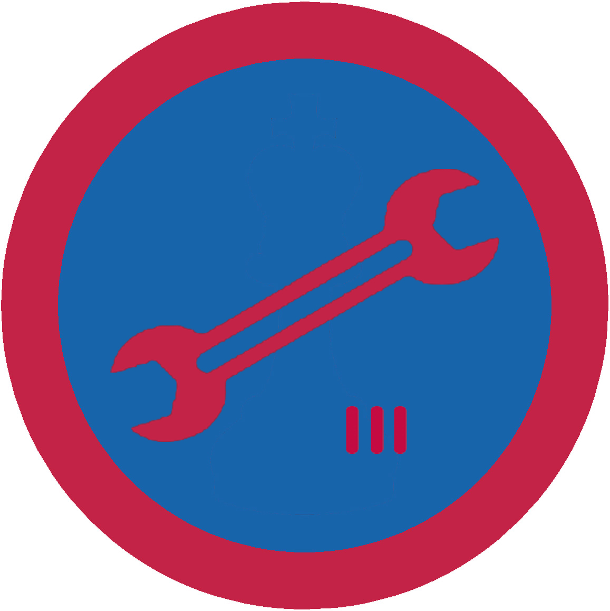

# Автознавство ІІІ

## Спеціалізація

Загальні вмілості

## Статус

Затверджена

## Останнє оновлення інформації вмілості

2020-04-29T03:12:33.714Z

## Рівень вмілості

3 проба

## Відзначка

## Вимоги до юнацтва

  

1. Вправно водити авто і відповідати всім вимогам Державної
автоінспекції.

2. Відмінно знати правила автодорожнього руху.

3. Знати особливості водіння авта у несприятливих умовах.

4. Вміти підготувати авто для обслуговування в автосервісі.

5. Навчити одного з друзів водити авто.    код на badgecraft.eu: upu_avtozn3 

## Вимоги до інструкторів

Даний розділ ще не є заповнений інформацією!

## Код на badgecraft.eu

upu_avtozn3