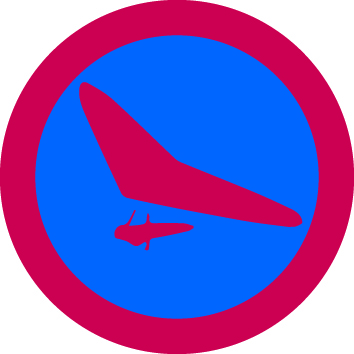

# Дельтапланеризм - ІІІ проба

## Спеціалізація

Летунська

## Статус

Апробаційна

## Останнє оновлення інформації вмілості

2020-04-28T03:13:27.819Z

## Рівень вмілості

1 проба

## Відзначка

## Вимоги до юнацтва

1.&nbsp;&nbsp;&nbsp;&nbsp;&nbsp;&nbsp;&nbsp;&nbsp;
Виконати самостійний заліковий політ
на дельтаплані по прямій довжиною не менше 50 м, (вітер до 8 м/с, висота старту
до 200 м).

Умови виконання:

2.&nbsp;&nbsp;&nbsp;&nbsp;&nbsp;&nbsp;&nbsp;&nbsp;
Закінчити навчальну підготовку по
дельтапланеризму та отримати оцінку не нижче ніж «добре».

3.&nbsp;&nbsp;&nbsp;&nbsp;&nbsp;&nbsp;&nbsp;&nbsp;
Мати допуск на виконання польотів в
простих метеоумовах на стартах з перепадом висот до 100 м (вітер до 8 м\с ,
пориви до 2 м\с, «термічка» - слабка, видимість добра).

4.&nbsp;&nbsp;&nbsp;&nbsp;&nbsp;&nbsp;&nbsp;&nbsp;
Провести один льотний день на літовищі
в якості керівника польотів або його замісника і провести самостійно розбір
польотів по завершенню кожного польоту або всього льотного дня. Або бути два
дні інструктором на летунській ділянці.

5.&nbsp;&nbsp;&nbsp;&nbsp;&nbsp;&nbsp;&nbsp;&nbsp;
Пояснення до т. П. п.:

-&nbsp;&nbsp;&nbsp;&nbsp;&nbsp; виконати
посадку проти вітру на ноги

-&nbsp;&nbsp;&nbsp;&nbsp;&nbsp; Можливе
виконання польоту за допомогою засобів механізованого старту (лебідка).

-&nbsp;&nbsp;&nbsp;&nbsp;&nbsp; Відбуття
одного дня керівником польотів або двох днів інструктором летунської ділянки здійснюється
під контролем дійсного КП і всіх інструкторів летунських ділянок на летовищі.

-&nbsp;&nbsp;&nbsp;&nbsp;&nbsp; Розказати
про виконання вимушеної посадки, забезпечення безпеки людей на посадці. Вихід
до найближчого населеного пункту і повідомлення про своє місце знаходження
пошукову групу і керівника польотів.

-&nbsp;&nbsp;&nbsp;&nbsp;&nbsp;
За бажання пілота можлива заміна
залікової вправи на вправу вищої складності за умови наявності допуску на
виконання вправи та згоди перевіряючого інструктора.

## Вимоги до інструкторів

Даний розділ ще не є заповнений інформацією!

## Код на badgecraft.eu

