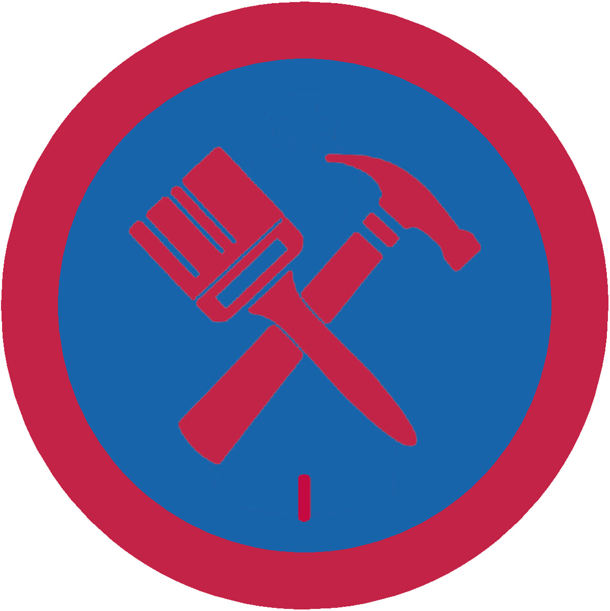

# Домашня зарадність І

## Спеціалізація

Загальні вмілості

## Статус

Затверджена

## Останнє оновлення інформації вмілості

2020-05-03T07:41:20.899Z

## Рівень вмілості

1 проба

## Відзначка

## Вимоги до юнацтва

  

1. Виконати вдома або в пластовій домівці десять з поданих нижче
робіт:

а) повісити картину або полицю;

б) помити вікно і підвіконник;

в) склеїти розбитий посуд, справити дерев'яний предмет;

г) забезпечити на зиму вікно або двері;

ґ) замінити електричну лампочку;

д) нагострити ніж;

е) полатати подертий одяг;

є) вичистити килим;

ж) помити посуд;

з) відремонтувати книгу;

и) почистити взуття;

і) приготувати сніданок;

ї) прибрати в своїй кімнаті;

к) почистити одяг.

2. Знати ціни на основні харчові продукти (хліб, масло, сметану,
сир, крупи, ковбасу, деякі овочі і фрукти).

3. Знати, які знаряддя повинні бути в кожній хаті для дрібних
поправок, до кого звернутися за різними направками, вміти оберігати різні
знаряддя від знищення.

4. Знати і дотримуватися правил безпеки користування інструментами.    код на badgecraft.eu: upu_domzar1 

## Вимоги до інструкторів

Даний розділ ще не є заповнений інформацією!

## Код на badgecraft.eu

upu_domzar1