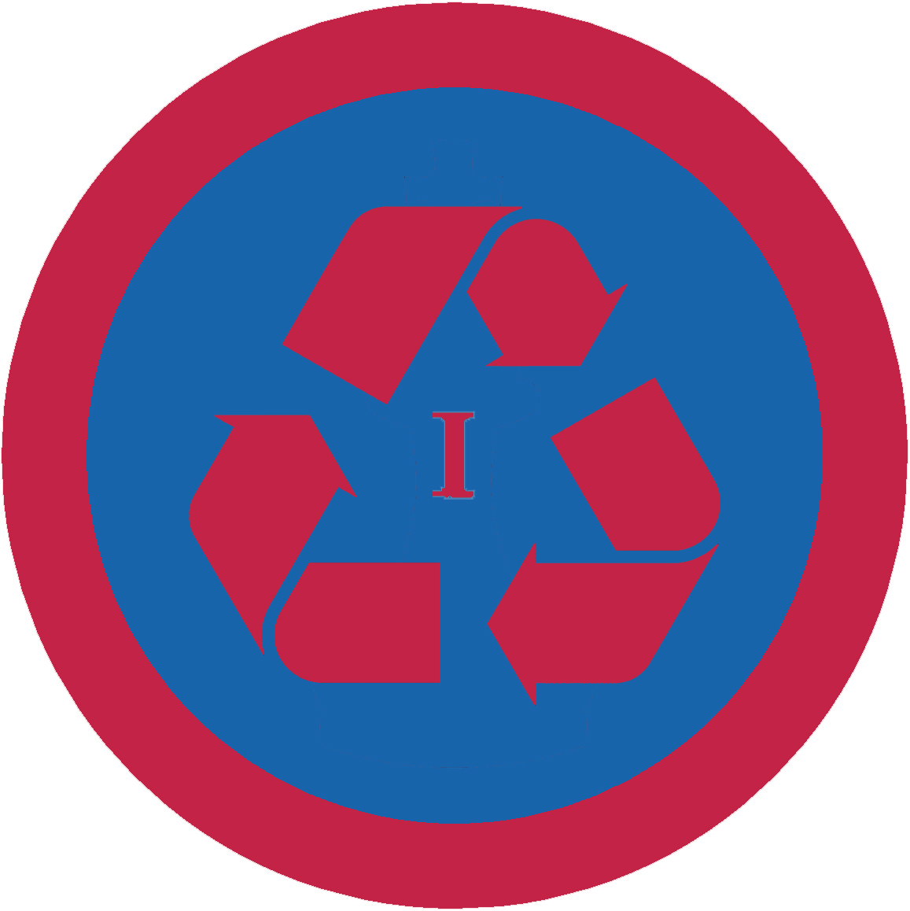

# Еколог І

## Спеціалізація

Загальні вмілості

## Статус

Затверджена

## Останнє оновлення інформації вмілості

2020-05-03T07:58:10.353Z

## Рівень вмілості

1 проба

## Відзначка

## Вимоги до юнацтва

<ol><li>З гуртком посадить своє дерево та візьме участь у екологічній акції.</li><li>Розкаже про основні шляхи забруднення навколишнього середовища і методи їх усунення.</li><li>Знає основні види поновлювальних джерел енергії та технології їх використання.</li><li>Розкаже, як можна вдома економити на споживанні енергії та знайде застосування одному наявному предметові і застосує його. Наведе приклад, як можна створити 10 нових речей з наявних.</li><li>Візьме участь у акції “Година Землі”. Знає про міжнародні та всеукраїнські екологічні фонди та організації.</li><li>Знає і розкаже про одного відомого українського еколога.7. Знає найбільші екологічні проблеми свого міста.</li></ol>   код на badgecraft.eu: upu_ecoloh1 

## Вимоги до інструкторів

Даний розділ ще не є заповнений інформацією!

## Код на badgecraft.eu

upu_ecoloh1