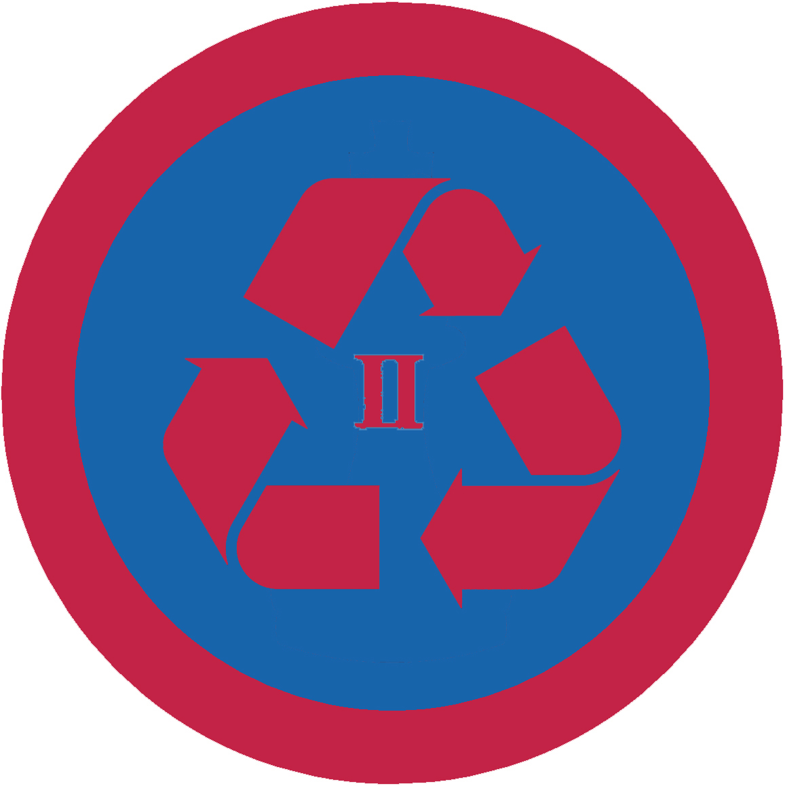

# Еколог ІІ

## Спеціалізація

Загальні вмілості

## Статус

Затверджена

## Останнє оновлення інформації вмілості

2020-05-03T08:05:05.587Z

## Рівень вмілості

2 проба

## Відзначка

## Вимоги до юнацтва

<ol><li>Посадить з куренем 100 дерев з естетичним оформленням прилеглої території.</li><li>Буде провідником групи людей на екологічній акції. Знати термін розкладання основних матеріалів та методи прискорення цього процесу.</li><li>Виготовить хоча б 5 речей з старих предметів.</li><li>Розкаже про поновлювальні джерела енергії (ПДЕ) та доведе, що зменшив витрати енергії у власному домі. Надасть приклади застосування п’яти старих предметів.</li><li>Змайструє прилад, який за допомогою ПДЕ буде давати енергію на світіння 12 вольтної лампочки та пояснить принцип його дії.</li><li>Ознайомиться хоча б з однією працею з екології. Знає видатних Українських та іноземних Екологів.</li><li>Здобуде вмілість Еколог І та залучить 10 людей до “Години Землі”.</li></ol>   код на badgecraft.eu: upu_ecoloh2 

## Вимоги до інструкторів

Даний розділ ще не є заповнений інформацією!

## Код на badgecraft.eu

upu_ecoloh2