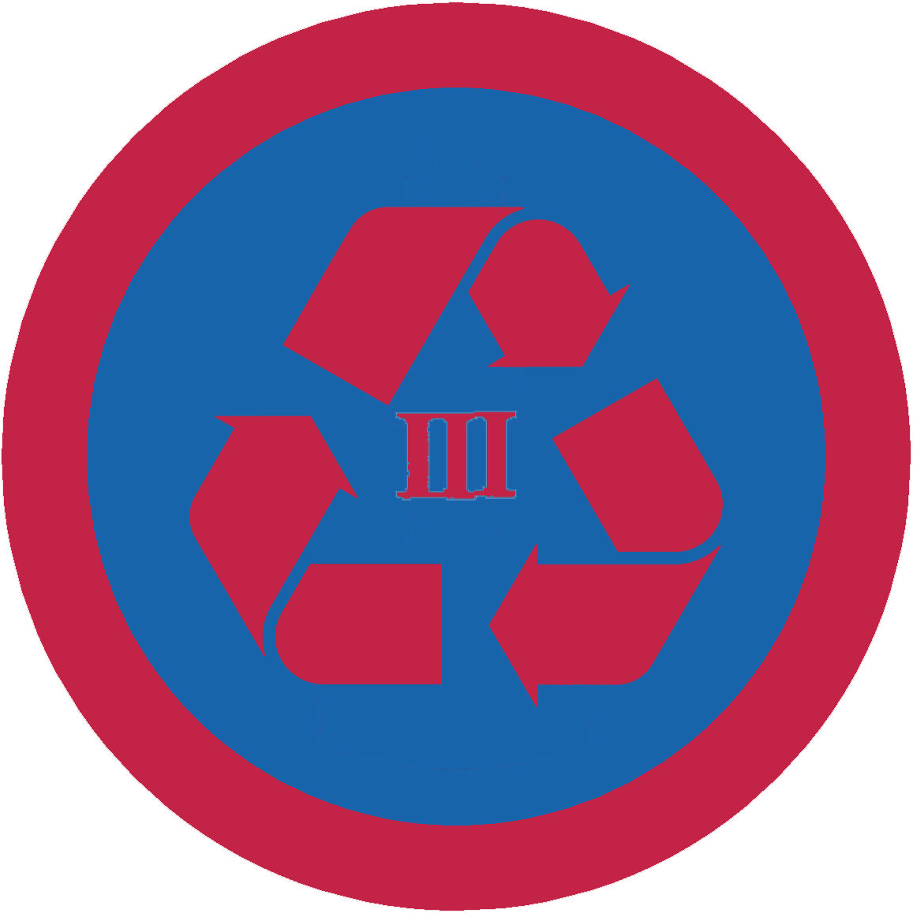

# Еколог ІІІ

## Спеціалізація

Загальні вмілості

## Статус

Затверджена

## Останнє оновлення інформації вмілості

2020-05-03T07:44:47.532Z

## Рівень вмілості

3 проба

## Відзначка

## Вимоги до юнацтва

<ol><li>Організує акцію з насадження дерев (понад 250 учасників)</li><li>Організує екологічну акцію (понад 250 учасників з агітаційною частиною проти засмічення прибраної території)</li><li>Організує та проведе ярмарок, на якому продасть будуть представлені вироби зі старих предметів.</li><li>Зорганізує висвітлення у засобах масової інформації результатів проведення двох акцій.</li><li>Проведе гутірку про поновлювальні джерела енергії та пояснить як можна економити вдома на спожитій енергії (в курені, станиці, школі, ВНЗ, тощо). Розкаже про використання старих предметів, продемонструє приклади.</li><li>Доведе, що зменшив витрати енергії в іншому місці крім в себе вдома (в школі, в сусідів, в домівці, тощо)</li><li>Здобуде вмілість Еколог ІІ та залучить 50 людей до “Години Землі”.</li></ol>   код на badgecraft.eu: upu_ecoloh3 

## Вимоги до інструкторів

Даний розділ ще не є заповнений інформацією!

## Код на badgecraft.eu

upu_ecoloh3