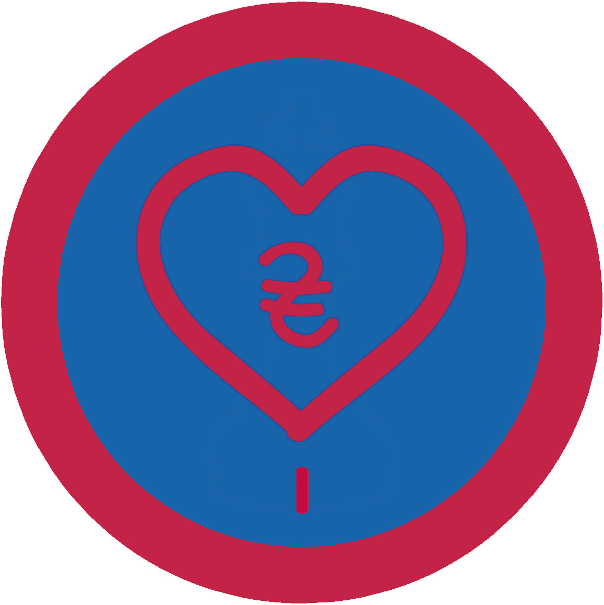

# Фандрейзинг I - ІІ проба

## Спеціалізація

Загальні вмілості

## Статус

Затверджена

## Останнє оновлення інформації вмілості

2020-07-23T15:37:26.286Z

## Рівень вмілості

2 проба

## Відзначка

## Вимоги до юнацтва

<ol><li>
Знає й розкаже проскладовіфандрейзингу та основні інструменти для його використання;
</li><li>
Сформує одну партнерську пропозицію;
</li><li>
Успішно налагодить співпрацю з одним донором/спонсором/партнером. Доведе співпрацю до логічного завершення;
</li><li>
Зоорганізує одну ініціативу зі збору коштів для курінного заходу;
</li><li>
Проведе гутірку для гуртка чи куреня де поділитися своїм досвідом, якого здобув займаючись фандрейзингом.
</li></ol>

## Вимоги до інструкторів

Інструктор повинен володіти базовими знаннями з фандрейзингу, як на професійному так і на аматорському рівнях. Має володіти кваліфікацію у формі участі в тренінгу з фандрейзингу як учасник, або як інструктор.

## Код на badgecraft.eu

