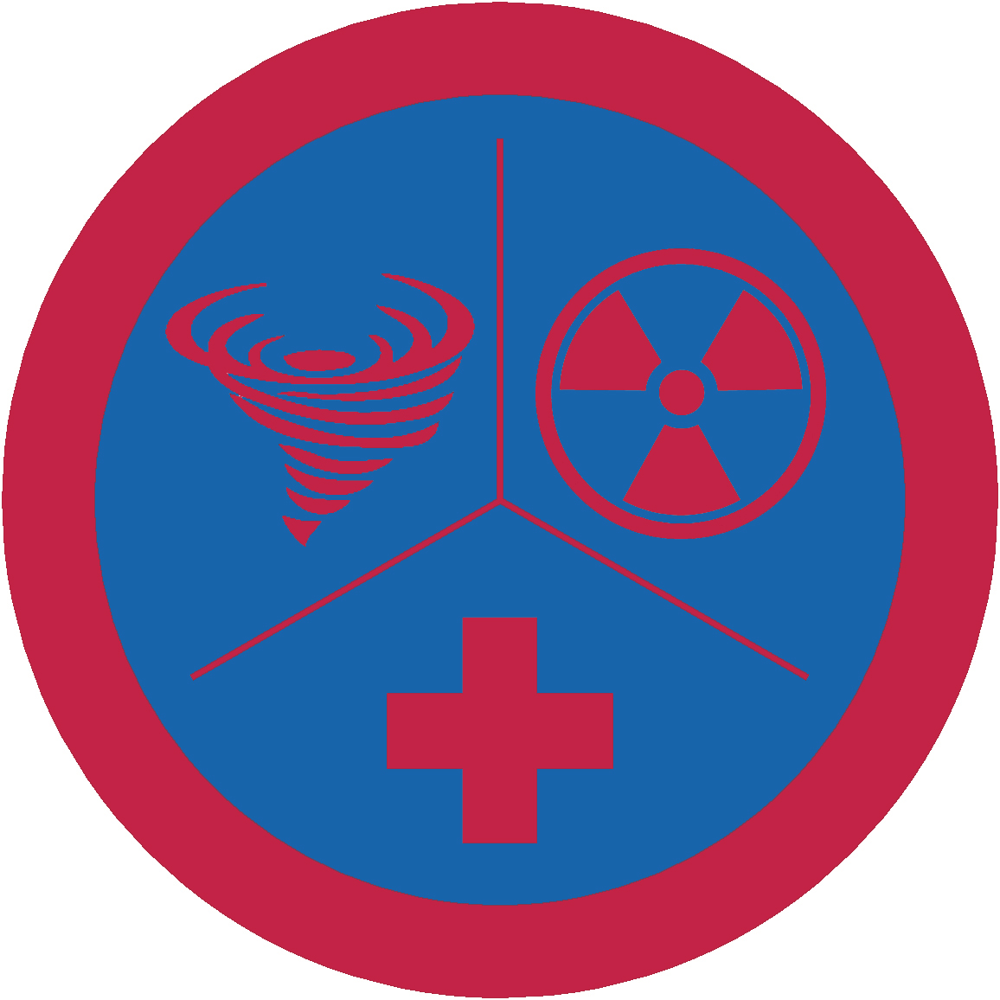

# Готовність до надзвичайних ситуацій - ІІ проба

## Спеціалізація

Загальні вмілості

## Статус

Затверджена

## Останнє оновлення інформації вмілості

2020-05-03T08:04:07.421Z

## Рівень вмілості

2 проба

## Відзначка

## Вимоги до юнацтва

  1.&nbsp;&nbsp;&nbsp; Отримай
відзнаку вмілості ПМД 2.&nbsp;&nbsp;&nbsp; Виконай
наступне: -&nbsp;&nbsp;&nbsp;&nbsp;&nbsp;&nbsp;&nbsp;&nbsp;&nbsp;
Обговори на сходинах аспекти готовності до
НС &nbsp; &nbsp;·&nbsp;Підготовка до НС &nbsp; &nbsp;·&nbsp;Реагування на НС &nbsp; &nbsp;·&nbsp;Відновлення після НС &nbsp; &nbsp;·&nbsp;Зменшення впливу і запобігання НС Додай
до обговорення питання, які важливі для самоусвідомлення кожного аспекту -&nbsp;&nbsp;&nbsp;&nbsp;&nbsp;&nbsp;&nbsp;&nbsp;&nbsp;
Склади таблицю, щоб продемонструвати своє
розуміння кожного з чотирьох аспектів готовності до НС (підготовка, реагування,
відновлення, зменшення впливу та запобігання) стосовно 10 з наведених нижче
ситуацій. Перші 5 є обов'язковими, решту вибери сам. Обговори цю таблицю на
сходинах: &nbsp; &nbsp;·&nbsp;<b>Пожежа
на кухні вдома </b>&nbsp; &nbsp;·&nbsp;<b>Пожежа
в підвалі будинку/складському приміщенні/гаражі </b>&nbsp; &nbsp;·&nbsp;<b>Вибух
у будинку </b>&nbsp; &nbsp;·&nbsp;<b>Автокатастрофа </b>&nbsp; &nbsp;·&nbsp;<b>Харчове
отруєння </b>&nbsp; &nbsp;·&nbsp;Пожежа або вибух у громадському місці &nbsp; &nbsp;·&nbsp;Автомобіль потрапив у снігову пастку &nbsp; &nbsp;·&nbsp;Повінь &nbsp; &nbsp;·&nbsp;Нещасний випадок у горах/віддаленій
місцевості &nbsp; &nbsp;·&nbsp;Аварія човна &nbsp; &nbsp;·&nbsp;Витік газу вдома або в будівлі &nbsp; &nbsp;·&nbsp;Ураган &nbsp; &nbsp;·&nbsp;Велика повінь &nbsp; &nbsp;·&nbsp;Аварія на АЕС &nbsp; &nbsp;·&nbsp;Сходження лавини чи зсув &nbsp; &nbsp;·&nbsp;Насильство в громадському місці -&nbsp;&nbsp;&nbsp;&nbsp;&nbsp;&nbsp;&nbsp;&nbsp;&nbsp;
Збери свою сім'ю і навчи їх як
укомплектувати аварійний набір, скласти план і бути в курсі ситуації, згідно з
таблицею, яку ти зробив. Складіть сімейний план. Обговори на сходинах вашу
сімейну нараду і складений план 3.&nbsp;&nbsp;&nbsp; Поясни,
як рятувати людину в наступних випадках: -&nbsp;&nbsp;&nbsp;&nbsp;&nbsp;&nbsp;&nbsp;&nbsp;&nbsp;
Ураження побутовим електричним струмом -&nbsp;&nbsp;&nbsp;&nbsp;&nbsp;&nbsp;&nbsp;&nbsp;&nbsp;
Кімната заповнена чадним газом -&nbsp;&nbsp;&nbsp;&nbsp;&nbsp;&nbsp;&nbsp;&nbsp;&nbsp;
Загоряння одягу -&nbsp;&nbsp;&nbsp;&nbsp;&nbsp;&nbsp;&nbsp;&nbsp;&nbsp;
Утоплення (в тому числі провалення під лід) 4.&nbsp;&nbsp;&nbsp; Покажи
три способи, як подати сигнал рятувальникам 5.&nbsp;&nbsp;&nbsp; Разом
з помічником покажи, як транспортувати пораненого з віддаленої місцевості, при
цьому зберігаючи свою енергію та забезпечуючи захист постраждалого 6.&nbsp;&nbsp;&nbsp; Виконай
наступне: -&nbsp;&nbsp;&nbsp;&nbsp;&nbsp;&nbsp;&nbsp;&nbsp;&nbsp;
Розкажи що повинні бути готові зробити
пластуни, який необхідний рівень підготовки і які запобіжні заходи вони повинні
прийняти для роботи в наступних аварійних службах: &nbsp; &nbsp;·&nbsp;Координація натовпу та управління рухом &nbsp; &nbsp;·&nbsp;Служба сповіщення і комунікації &nbsp; &nbsp;·&nbsp;Збір і розподіл послуг &nbsp; &nbsp;·&nbsp;Служба харчування, поселення і санітарії -&nbsp;&nbsp;&nbsp;&nbsp;&nbsp;&nbsp;&nbsp;&nbsp;&nbsp;
Назви державні або громадські організації,
які, як правило, керують і підготовляються до роботи в службах з попереднього
пункту. Поясни як гурток може допомогти в разі таких надзвичайних ситуацій -&nbsp;&nbsp;&nbsp;&nbsp;&nbsp;&nbsp;&nbsp;&nbsp;&nbsp;
З'ясуй хто є відповідальною особою з
надзвичайних ситуацій і з'ясуй у нього що він робить для того щоб бути готовим
до НС, реагувати, відновлювати і зменшувати вплив та запобігати НС. Обговори це
на сходинах і порівняй з табличкою, яку ти складав у пункті&nbsp;2 7.&nbsp;&nbsp;&nbsp; Візьми
участь у проекті аварійної служби, реальному чи практичних навчаннях разом з
гуртком або місцевою громадою 
8.&nbsp;&nbsp;&nbsp; Зроби
наступне: -&nbsp;&nbsp;&nbsp;&nbsp;&nbsp;&nbsp;&nbsp;&nbsp;&nbsp;
Підготуй письмовий план мобілізації свого
гуртка при НС. Якщо такий план вже існує – поясни його. Розкажи про свою участь
у ньому при НС -&nbsp;&nbsp;&nbsp;&nbsp;&nbsp;&nbsp;&nbsp;&nbsp;&nbsp;
Візьми участь у навчальному тренуванні по
реагуванні на НС. Перед тренуванням опиши свою частину роботи виховнику. Після
тренування, обговори що ти дізнався під час навчань і чи потрібно ввести
додаткові зміни чи коригування плану мобілізації -&nbsp;&nbsp;&nbsp;&nbsp;&nbsp;&nbsp;&nbsp;&nbsp;&nbsp;
Підготуй особистий екстрений набір на
випадок НС. Підготуй сімейний комплект (водонепроникний ящик чи коробку) для
використання твоєю родиною в разі евакуації при НС. Поясни, що повинно в ньому
бути і для чого 9.&nbsp;&nbsp;&nbsp; Виконай
ОДНЕ з наступного: -&nbsp;&nbsp;&nbsp;&nbsp;&nbsp;&nbsp;&nbsp;&nbsp;&nbsp;
Використовуючи перелік небезпек,
затверджений виховником, перевір свій будинок на потенційні небезпеки. Поясни
небезпеки, які ти знайшов і як вони можуть бути виправлені -&nbsp;&nbsp;&nbsp;&nbsp;&nbsp;&nbsp;&nbsp;&nbsp;&nbsp;
Переглянь або розроби план евакуації для
своєї сім'ї у випадку пожежі у вашому будинку -&nbsp;&nbsp;&nbsp;&nbsp;&nbsp;&nbsp;&nbsp;&nbsp;&nbsp;
Розроби програми щодо запобігання нещасних
випадків для твоєї сім'ї на 5 заходів за межами будинку (пікнік, перегляд
фільму і т.п.), які включатимуть аналіз можливих небезпек, пропонований план
для виправлення цих небезпек і причини для поправок     

код на badgecraft.eu: upu_hdns 

## Вимоги до інструкторів

Даний розділ ще не є заповнений інформацією!

## Код на badgecraft.eu

upu_hdns