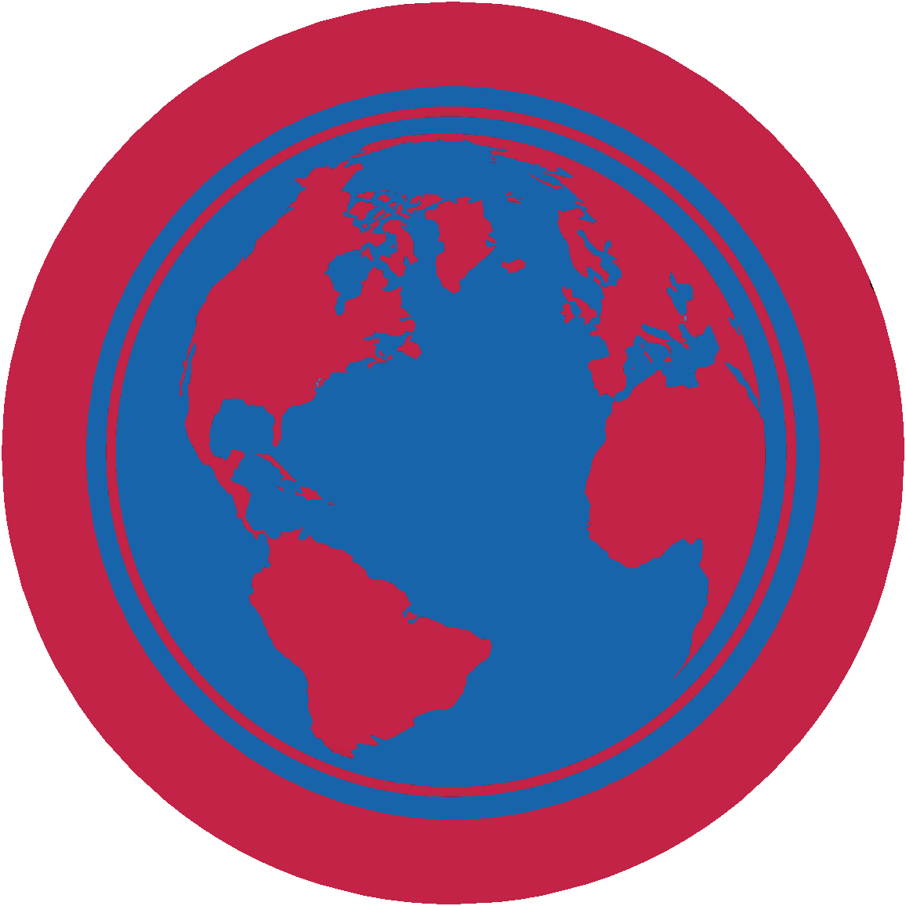

# Громадянин світу - ІІ проба

## Спеціалізація

Загальні вмілості

## Статус

Затверджена

## Останнє оновлення інформації вмілості

2020-05-03T07:37:35.275Z

## Рівень вмілості

2 проба

## Відзначка

## Вимоги до юнацтва

  1.&nbsp;&nbsp;&nbsp;
Поясни, як ти
розумієш поняття громадянин світу і що потрібно робити, щоб стати добрим
громадянином світу 2.&nbsp;&nbsp;&nbsp;
Поясни як людина
набуває українського громадянства, поясни права, обов’язки та громадянські
обов'язки українського громадянства. Обговори подібності та відмінності між
правами, обов’язками та громадянськими обов'язками громадян України та громадян
двох інших країн на вибір 3.&nbsp;&nbsp;&nbsp;
Виконай наступне: ·&nbsp;&nbsp;&nbsp;&nbsp;&nbsp;&nbsp;&nbsp;&nbsp;
Вибери поточну
світову подію. Обговори на сходинах, як національні інтереси України, її
відносини з іншими країнами можуть вплинути на такі галузі як безпека,
економіка, цінності, здоров'я її громадян, у зв’язку із цією подією ·&nbsp;&nbsp;&nbsp;&nbsp;&nbsp;&nbsp;&nbsp;&nbsp;
Вибери іншу країну
і обговори на сходинах як її географія, природні ресурси і клімат впливають на
економіку і її глобальне партнерство з іншими країнами 4.&nbsp;&nbsp;&nbsp;
Виконай ДВА з
наступних завдань: ·&nbsp;&nbsp;&nbsp;&nbsp;&nbsp;&nbsp;&nbsp;&nbsp;
Поясни міжнародне
право і чим воно відрізняється від національного законодавства. Поясни роль
міжнародного права, і як міжнародне право може бути використане як інструмент
для вирішення конфлікту ·&nbsp;&nbsp;&nbsp;&nbsp;&nbsp;&nbsp;&nbsp;&nbsp;
Використовуючи
головні щоденні газети, Інтернет, новинні журнали спостерігай поточну проблему,
яка включає міжнародну торгівлю, іноземну валюту, платіжні баланси, тарифи і
вільну торгівлю. Поясни що ти дізнався. Доповни своє обговорення поясненням
того, чому країни повинні співпрацювати у світовій торгівлі і глобальній
конкуренції, щоб процвітати ·&nbsp;&nbsp;&nbsp;&nbsp;&nbsp;&nbsp;&nbsp;&nbsp;
Вибери ДВІ з
наступних організацій і опиши їх роль у світі: -&nbsp;&nbsp;&nbsp;&nbsp;&nbsp;&nbsp;&nbsp;&nbsp;&nbsp;
ООН -&nbsp;&nbsp;&nbsp;&nbsp;&nbsp;&nbsp;&nbsp;&nbsp;&nbsp;
Міжнародний суд -&nbsp;&nbsp;&nbsp;&nbsp;&nbsp;&nbsp;&nbsp;&nbsp;&nbsp;
ВОСР -&nbsp;&nbsp;&nbsp;&nbsp;&nbsp;&nbsp;&nbsp;&nbsp;&nbsp;
ВООЗ -&nbsp;&nbsp;&nbsp;&nbsp;&nbsp;&nbsp;&nbsp;&nbsp;&nbsp;
Міжнародна амністія -&nbsp;&nbsp;&nbsp;&nbsp;&nbsp;&nbsp;&nbsp;&nbsp;&nbsp;
Міжнародний Комітет
Червоного Хреста -&nbsp;&nbsp;&nbsp;&nbsp;&nbsp;&nbsp;&nbsp;&nbsp;&nbsp;
CARE 5.&nbsp;&nbsp;&nbsp;
Виконай наступне: ·&nbsp;&nbsp;&nbsp;&nbsp;&nbsp;&nbsp;&nbsp;&nbsp;
Обговори
відмінності між конституційними і неконституційними типами правління ·&nbsp;&nbsp;&nbsp;&nbsp;&nbsp;&nbsp;&nbsp;&nbsp;
Назви хоча б 5
різних типів правління в світі на сьогодні ·&nbsp;&nbsp;&nbsp;&nbsp;&nbsp;&nbsp;&nbsp;&nbsp;
Покажи на карті
світу країни, які використовують кожну з цих 5-ти форм правління 6.&nbsp;&nbsp;&nbsp;
Виконай наступне: ·&nbsp;&nbsp;&nbsp;&nbsp;&nbsp;&nbsp;&nbsp;&nbsp;
Поясни, як уряд
України представлено за кордоном і як Україна акредитована в міжнародних
організаціях ·&nbsp;&nbsp;&nbsp;&nbsp;&nbsp;&nbsp;&nbsp;&nbsp;
Опиши ролі
наступних інстанцій у проведені міжнародних відносин: &nbsp; &nbsp;-&nbsp;Посол &nbsp; &nbsp;-&nbsp;Консул &nbsp; &nbsp;-&nbsp;Бюро міжнародних
інформаційних програм &nbsp; &nbsp;- Агентство
міжнародного розвитку ·&nbsp;&nbsp;&nbsp;&nbsp;&nbsp;&nbsp;&nbsp;&nbsp;
Поясни мету
паспорта та візи для міжнародних поїздок 7.&nbsp;&nbsp;&nbsp;
Виконай ДВА з
наступних завдань і розкажи чого ти навчився: ·&nbsp;&nbsp;&nbsp;&nbsp;&nbsp;&nbsp;&nbsp;&nbsp;
Відвідай сайт
кабінету міністрів України. Дізнайся більше про проблему, яка тобі цікава і яка
обговорюється на сайті ·&nbsp;&nbsp;&nbsp;&nbsp;&nbsp;&nbsp;&nbsp;&nbsp;
Відвідай сайт
міжнародної організації новин або іноземного уряду або вивчи іноземні газети.
Знайди новину про право людини, яке реалізується в Україні, але не визнається в
іншій державі ·&nbsp;&nbsp;&nbsp;&nbsp;&nbsp;&nbsp;&nbsp;&nbsp;
Зустрінься
(сконтактуйся) із студентом або скаутом із іншої країни і обговори їхні звичаї,
свята, народні продукти, традиції на практиці ·&nbsp;&nbsp;&nbsp;&nbsp;&nbsp;&nbsp;&nbsp;&nbsp;
Відвідай всесвітнє
скаутське джемборі ·&nbsp;&nbsp;&nbsp;&nbsp;&nbsp;&nbsp;&nbsp;&nbsp;&nbsp;Бери
участь або відвідуй міжнародні змагання, фестивалі, концерти або ігри    код на badgecraft.eu: upu_citizen_w 

## Вимоги до інструкторів

Даний розділ ще не є заповнений інформацією!

## Код на badgecraft.eu

upu_citizen_w