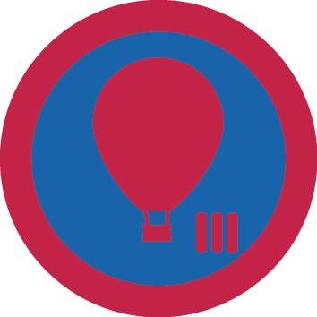

# Історія авіації ІІІ

## Спеціалізація

Летунська

## Статус

Затверджена

## Останнє оновлення інформації вмілості

2020-05-03T07:23:58.724Z

## Рівень вмілості

3 проба

## Відзначка

## Вимоги до юнацтва

<b>Історія авіації 3</b>

 

<b>1. </b>Здобуде вмілість «Історія авіації 2».

<b> 2. </b>Знає про» Золотий вік літакобудування»( 1918- &nbsp;1939 рр.). Розповість про кубок Шнайдера та &nbsp;Чарльза Лінденберга, Джона Оклока, Джемі Дулітла, &nbsp;Френка Уітлла.

<b> 3. </b>Знає про відомих жінок в авіації. Розповість про &nbsp;Амелію Ерхард та баронесу Раймон де Ларош.

<b> 4. </b>Розповість про розвиток авіації в часи Другої світової війни та про головних асів країн учасниць війни (Німеччини, Великобританії,СРСР, США, Франції та Японії). Розповість про головні авіаційні бої цього часу (Битва за Британію, Перл Харбор та інші).

<b> 5. </b>Розповість про розвиток авіації в часи Холодної війни,зокрема про перші надзвукові польоти (Concorde, Ту-144) та про освоєння космосу (Юрій Гагарін &nbsp;і перший політ людини в космос та Ніл Армстронг і його політ на місяць).&nbsp;

<b> 6. </b>Знає про розвиток авіації на території України. Розповість про авіаконструктора Сікорського, відомих українських космонавтів (Леоніда Каденюка, Гайдемарі Стефанишин-Пайпер та ін.) та про &nbsp;пілотажну групу &nbsp;«Українські Соколи».

<b> 7. </b>Знає історію виникнення перших парапланів та дельтапланів. Розповість про їх будову і сучасний розвиток &nbsp;в Україні та світі.

<b> 8. </b>Ознайомиться з історією виникнення та розвитку основних авіаконструкторських компаній світу та України (Boeing, Airbus, Антонов та ін.. ).

<b> 9. </b>Проведе 2 інструктажі на тему : «Сучасний розвиток авіації в Україні та світі».  Вмілість розробив ст.пл. Андрій Королишин, ЧоК    код на badgecraft.eu: upu_istavia3 

## Вимоги до інструкторів

Інструктор володіє вмілостями Історія авіації 1,2,3, або відповідний сертифікат.

## Код на badgecraft.eu

upu_istavia3