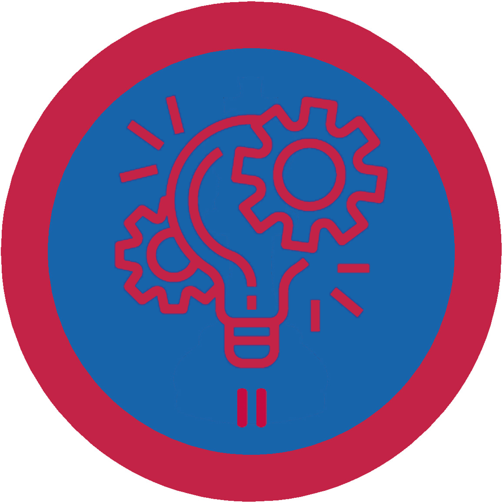

# Керівник проєктів II - ІІІ проба

## Спеціалізація

Загальні вмілості

## Статус

Затверджена

## Останнє оновлення інформації вмілості

2020-07-23T15:35:22.427Z

## Рівень вмілості

3 проба

## Відзначка

## Вимоги до юнацтва

<ol><li>
Підготує план реалізації проєкту станичного, окружного або крайового рівня, який міститиме:
</li><ul><li>
Короткий опис ідеї майбутнього проєкту;
</li><li>
Аналіз середовища проєкту за щонайменше двома методами;
</li><li>
Мету, задачі, цілі проєкту;
</li><li>
Аналіз зацікавлених сторін проєкту;
</li><li>
Обмеження та допущення проєкту;
</li><li>
Організаційну структуру команди та структуру робіт проєкту;
</li><li>
Календарний план проєкту;
</li><li>
Бюджет проєкту;
</li><li>
Матрицю відповідальності проєкту;
</li><li>
План управління ризиками проєкту;
</li><li>
План управління комунікаціями проєкту;
</li><li>
План управління якістю проєкту.
</li></ul><li>
Реалізує запланований проєкт, дотримуючись критеріїв якості та обмежень проєкту. При цьому, керуватиме проєктом загалом, а не його частиною, відповідатиме за загальний результат;
</li><li>
Розповість про основні принципи застосування гнучких методологій управління проєктами.
</li></ol>

## Вимоги до інструкторів

Одне з перерахованого:
<ol><li>
Здобуде вмілість "Керівник проєктів ІІ";
</li><li>
Має, щонайменше, півроку професійного або волонтерського досвіду роботи на посаді керівника проєктів.
</li></ol>

## Код на badgecraft.eu

