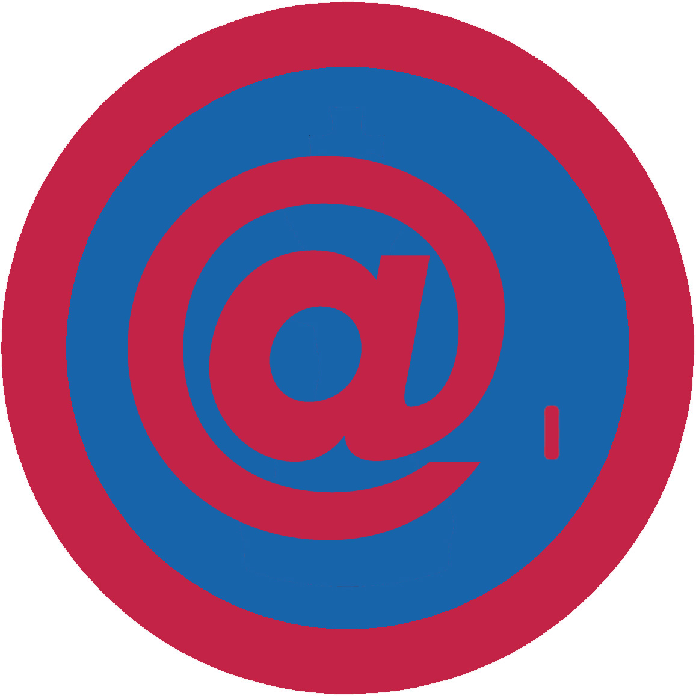

# Користувач Інтернету І - ІІ проба

## Спеціалізація

Загальні вмілості

## Статус

Затверджена

## Останнє оновлення інформації вмілості

2020-05-03T07:56:58.776Z

## Рівень вмілості

2 проба

## Відзначка

## Вимоги до юнацтва

 <ol>
 <li>Виконав вимоги вмілості «Знавець комп’ютерів І». </li>
 <li>Знає історію виникнення Інтернету та його сучасний
     стан.</li>
 <li>Вміє знайти сторінки в Інтернеті,
     які його цікавлять; знайшов/-ла інтернет-сторінки пластових частин.</li>
 <li>Знайшов/-ла в Інтернеті необхідну йому/їй
     інформацію, використав/-ла її на сходинах.</li>
 <li>Налаштував/-ла account в
     поштовому клієнті, переслав/-ла та прийняв/-ла інформацію, використовуючи
     електронну пошту, бере участь принаймі в одній групі новин. </li>
 <li>Знає і використовує найвживаніші Інтернет-терміни
     (наприклад: сервер, гіперпосилання, протокол, http, ftp, домен,
     хостинг тощо).</li><li>Вміє
знайти в Інтернеті необхідне програмне забезпечення, знає роди ліцензій і їх
використовує. </li></ol>   код на badgecraft.eu: upu_korint1 

## Вимоги до інструкторів

Даний розділ ще не є заповнений інформацією!

## Код на badgecraft.eu

upu_korint1