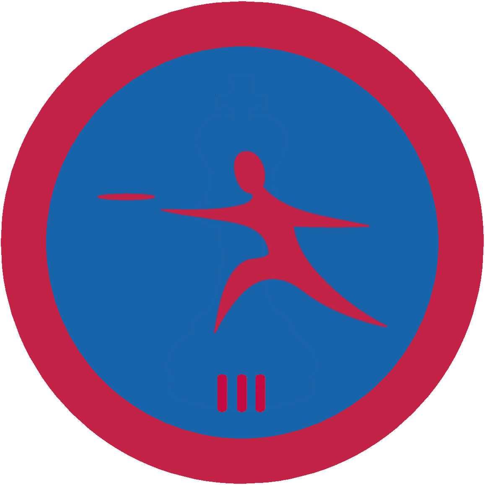

# Літаючий диск ІІІ

## Спеціалізація

Спортивна

## Статус

Затверджена

## Останнє оновлення інформації вмілості

2020-07-13T15:38:43.731Z

## Рівень вмілості

3 проба

## Відзначка

## Вимоги до юнацтва

1. Виконає вимоги вмілості "Літаючий диск ІІ" 

2. Знає та демонструє відмінне знання правил гри в алтимат та пройде тест "Advanced" (<a target="_blank" rel="nofollow" href="http://rules.wfdf.org/accreditation">http://rules.wfdf.org/accreditation</a>) ВФЛД на знання правил (підтверджується сертифікатом)

3. Знає про розвиток ігор з літаючим диском у світі та знає про найбільші міжнародні турніри

4. Візьме участь у складі команди в турнірі, що проводиться УФЛД, обласною федерацією літаючого диску (чи іншому турнірі схожого рівня)

5. Вміє правильно пояснити техніку виконання основних кидків (бекхенд та форхенд) та може навчити їх

6. Проведе змаг з алтимату для УПЮ

## Вимоги до інструкторів

1. Успішно пройде тест "Advanced" (<a target="_blank" rel="nofollow" href="http://rules.wfdf.org/accreditation">http://rules.wfdf.org/accreditation</a>) ВФЛД на знання правил алтимату (підтверджується сертифікатом)

2. Є зареєстрованим членом УФЛД або на постійній основі тренується та бере участь в змаганнях в складі однієї з команд з алтимату

3. Знає про основні правила безпеки під час проведення занять з фізичної культури і спорту

## Код на badgecraft.eu

