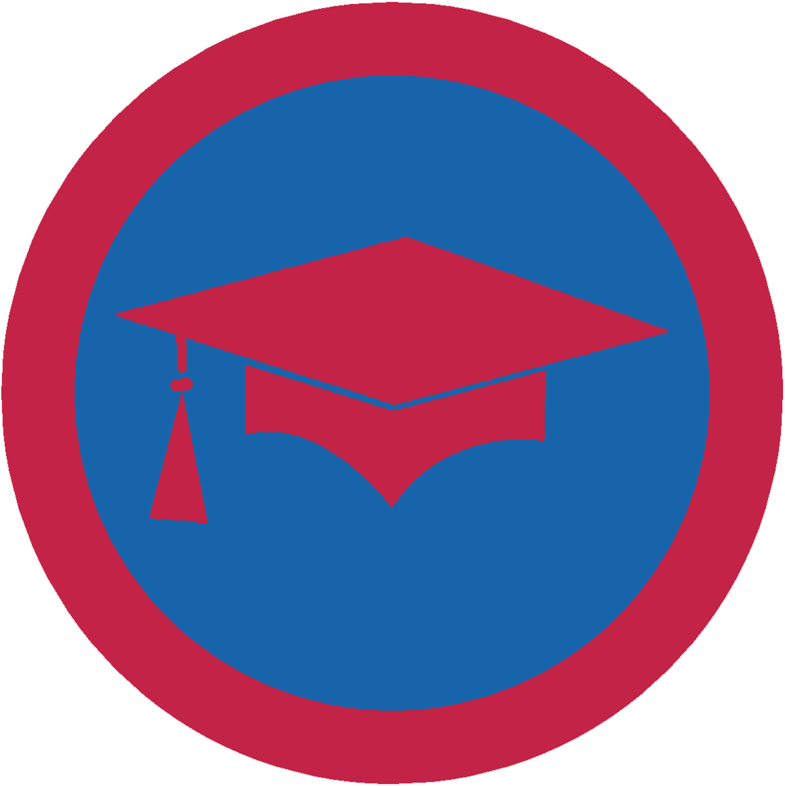

# Освіта - ІІ проба

## Спеціалізація

Загальні вмілості

## Статус

Затверджена

## Останнє оновлення інформації вмілості

2020-05-03T08:01:47.094Z

## Рівень вмілості

2 проба

## Відзначка

## Вимоги до юнацтва

  1. Виконай
ОДНЕ з наступних завдань: - Набери
середній бал "10" за один семестр (підтвердити табелем успішності) -Доведи,
що ти покращив свої шкільні оцінки за семестр в порівнянні з попереднім 2. Виконай
ТРИ з наступних завдань: - Склади
список освітніх закладів твого міста (окрім шкіл). Відвідай один із них і
розкажи, як ти можеш використати його для самоосвіти - Проведи
співбесіду із двома фахівцями з освіти, але не з твоєї школи. Дізнайся де вони
отримали свою освіту, які тренінги проходили, і як ця освіта та тренінги
допомогли їм в роботі. Дізнайся, як вони продовжують свою освіту і підвищують
кваліфікацію. Обговори все що дізнався на сходинах - Використовуючи
щоденник, покажи, як ти слідкуєш за своїми заняттями і заходами, а також
обговори на сходинах як ти управляєш своїм часом - Обговори
переваги і недоліки різних дослідницьких методів, які доступні тобі для
виконання домашніх завдань (бібліотеки, книги, часописи, Інтернет) 3. Виконай
ДВА з наступних завдань: - Візьми
участь у позакласній діяльності школи, розкажи про позитиви такої діяльності і
що ти дізнався про важливість спільної роботи - Обговори
участь в шкільному проекті протягом останнього півріччя, де ти був частиною
команди. Розкажи про свій внесок для команди і проекту -
Долучись до діяльності учнівського самоврядування та розкажи в яких
проектах/акціях ти приймав участь чи організовував їх 4. Проведи
дискусію в гуртку чи у своєму класі на одну із тем: 1.&nbsp;&nbsp;&nbsp;&nbsp;&nbsp; «Здобуття
освіти в Україні і за кордоном: вибір сьогоднішнього покоління» 2.&nbsp;&nbsp;&nbsp;&nbsp;&nbsp; «Що
важливіше: багато знати чи вміти знаходити інформацію» 3.&nbsp;&nbsp;&nbsp;&nbsp;&nbsp; «Самоосвіта
впродовж життя» 5. Розкажи
про активне, пасивне та інтерактивне види навчання. Назви переваги та недоліки
кожного з них 6.
Розкажи про альтернативні джерела отримання знань (он-лайн курси, гуртки і
т.п.). Відшукай щонайменше 2 таких джерела, які є актуальними для якої-небудь
професії (можливо обраної тобою) 7.
Розкажи про міжнародні освітні програми для молоді (нп. Еразмус, FLEX і т.п.).
Дізнайся як вони представлені в Україні та умови, які умови необхідно виконати,
щоб взяти у них участь 8.
Візьми участь в олімпіаді з будь-якого навчального предмету чи галузі,
обґрунтуй важливість участі в різних конкурсах і змаганнях для самоосвіти 9.
Визнач щонайменше 5 спеціальностей, до яких у тебе є здібності. Вкажи &nbsp;їх
позитивні негативні риси. З’ясуй, яку освіту необхідно здобути, щоб отримати
відповідну спеціальність 10. Склади
програму самоосвіти і обговори її із батьками та виховником, визнач шляхи її
реалізації і необхідні ресурси    код на badgecraft.eu: upu_osvita 

## Вимоги до інструкторів

Даний розділ ще не є заповнений інформацією!

## Код на badgecraft.eu

upu_osvita