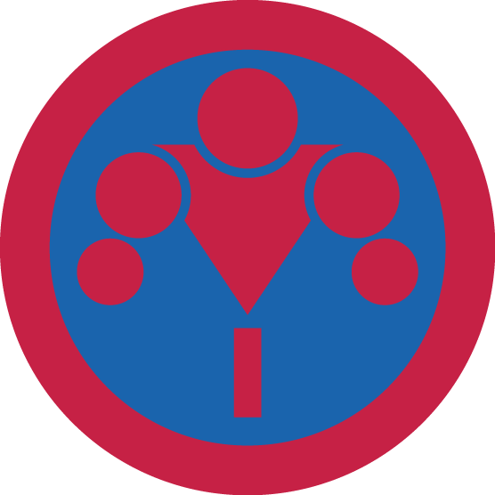

# Перекладина І

## Спеціалізація

Спортивна

## Статус

Затверджена

## Останнє оновлення інформації вмілості

2020-05-03T07:33:51.097Z

## Рівень вмілості

1 проба

## Відзначка

## Вимоги до юнацтва

<ol><li>Вміє правильно розім’яти м’язи перед тренуванням та виконанням певних елементів.</li><li>Знає що таке "воркаут", його походження та історію. Знає історію розвитку воркауту в Україні.</li><li>Виконає базу та елементи на 1 розряд з воркауту:</li></ol>
База:
<ul><li>Підтягування - 10</li><li>Відтискання на брусах - 15</li><li>Відтискання від підлоги - 20</li><li>Підняття рівних ніг у висі на турніку тримаючись двома руками - 3</li></ul>
Елементи:
<ul><li>Підйом переворотом - 3</li><li>Капітанський підйом - 1</li><li>Кут під турніком (хват на ширині плечей) - зафіксувати</li><li>Вихід силою на праву руку - 1</li><li>Вихід силою на ліву руку – 1</li></ul>
<b>База:</b>

Підтягування.&nbsp;Виконуються хватом зверху (долоні від себе). У верхній точці підборіддя обов'язково повинно виявитися вище перекладини. Вимагається повне розпрямлення рук при опусканні. При підтягуванні потрібно уникати допомоги ногами у вигляді ривків, поштовхів, махів. Намагайтеся тримати ноги рівними і зведеними.

Відтискання на брусах. У верхньому положенні руки повинні розгинатися повністю. У нижньому положенні кут між передпліччям і плечем не повинен перевищувати 90 градусів. Тіло потрібно тримати якомога рівніше (без розгойдування, без ривків, без звивань і т.п.). Потрібно уникати сильного нахилу вперед.

Відтискання від підлоги. Руки на ширині плечей. У верхній точці руки повністю випрямлені. У нижній точці відстань між грудьми і підлогою має бути мінімальною. Тіло тримати рівно, не прогинатися. Голова піднята.

Підняття рівних ніг у висі на турніку тримаючись двома руками. Носками доторкнутися до перекладини, ноги намагайтеся тримати прямими. Розгойдування повинно бути мінімальним. Хват (верхній, нижній) за бажанням. Руки не згинати.

Підняття рівних ніг у висі на турніку тримаючись однією рукою. Носками доторкнутися до перекладини, ноги намагайтеся тримати прямими. Розгойдування повинно бути мінімальним. Хват (верхній, нижній) за бажанням. Руку не згинати.

Відтискання у вертикальній стійці на руках біля стіни. Руки трохи ширше ширини плечей. Опускання до максимуму (торкання головою). Відтискання до повного випрямлення рук.

<b>Елементи:</b>

Підйом переворотом. Ноги повинні бути рівними. Обов'язкове випрямлення рук в упорі.

Капітанський підйом. Виконання силою (за рахунок сили рук, а не різкого закидання ніг з тазом на турнік). Бажано рівні ноги. Після виконання потрібно виконати вихід в сидяче положення.

Кут під турніком. Ноги повинні бути рівними. Кут між ногами і корпусом повинен бути 90 градусів.

Вихід силою на одну. Без розкачування. Без допомоги ніг. Обов'язкове випрямлення рук в упорі.

Виходи силою на дві&nbsp;(верхнім, нижнім, вузьким і широким хватом). Без розкачування. При опусканні і при виході в упор потрібно повністю розгинати руки. Обидві руки повинні переходити в верхнє положення одночасно. Хват відповідно з типом виходу. Допомога ногами мінімальна.

Горизонтальний вис ззаду&nbsp;(Ластівка). Тіло повинне бути рівним, та паралельним землі. Хват на ширині плечей (верхнім або нижнім хватом). Ноги повинні бути рівними і зведеними.

Горизонтальний вис спереду. Тіло повинне бути рівним, та паралельним землі. Хват на ширині плечей. Ноги повинні бути рівними і зведеними.

Повільний вихід на дві з кутиком. Спочатку зафіксувати кутик ногами. Кут між ногами і тілом 90 градусів. Підтягування повинно бути повільним (не менше 3 сек.). Обов'язкове випрямлення рук в упорі. У нижньому положенні дозволяється трохи згинати руки.

Підтягування на одній. В нижньому положенні рука повинна бути рівною. У верхньому положенні підборіддя повинно бути над перекладиною. Заборонені: допомога ногами, розгойдування, підстрибування від землі.

Рушник спереду. При підтягуванні до однієї руки друга рука повинна бути рівною. Спочатку потрібно перенести вагу на вільну руку, потім вийти в упор. В упорі руки повинні бути рівними.

Горизонтальний упор. Руки повинні бути або рівними, або зігнутими (залежно від вимоги на розряд). У разі виконання вправи з зігнутими руками, ноги повинні бути рівними і зведеними. У разі виконання вправи з рівними руками - ноги рівні (якщо 6-й розряд - розведені, на 7-й - зведені).

Силовий оборот вперед&nbsp;(підйом переворотом). Оборот повинен бути виконаний за рахунок сили, а не за рахунок помаху ногами перед виконанням елементу.

Прапорець. Тіло паралельне землі. Висіти боком. Виконується на будь-якому вертикальному снаряді. Руки рівні.

## Вимоги до інструкторів

Відповідає одній з кваліфікаційних вимог:
<ul><li>має спеціальну освіту у галузі фізичного виховання і спорту&nbsp;та відповідний освітньо-кваліфікаційний&nbsp; рівень;</li><li>має спортивний розряд не нижче другого юнацького з спортивної гімнастики або не нижче другого з воркауту;</li><li>успішно пройшов вишкіл інструкторів спортивного пластування чи аналогічний за своїм змістом вишкіл, затверджений референтурою Спортивного пластування.</li></ul>

## Код на badgecraft.eu

