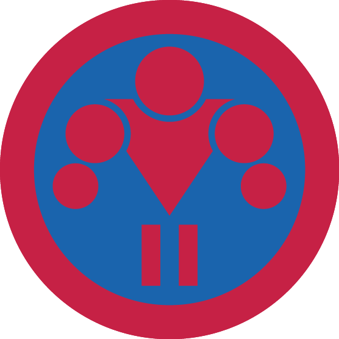

# Перекладина ІІ

## Спеціалізація

Спортивна

## Статус

Затверджена

## Останнє оновлення інформації вмілості

2020-05-03T07:34:45.992Z

## Рівень вмілості

2 проба

## Відзначка

## Вимоги до юнацтва

<ol><li>Проведе&nbsp; одне тренування з гуртком або куренем</li><li>Виконає базу та елементи на 2 розряд з воркауту:</li>
База:
<ul><li>Підтягування - 15</li><li>Відтискання на брусах - 20</li><li>Відтискання від підлоги - 30</li><li>Підняття рівних ніг у висі на турніку тримаючись двома руками - 6</li><li>Підняття рівних ніг у висі на турніку тримаючись однією рукою - 2</li></ul>
Елементи:
<ul><li>Вихід силою на дві - 2</li><li>Підйом переворотом - 6</li><li>Капітанський підйом - 1</li><li>Кут під турніком (хват на ширині плечей) - 3 секунди</li></ul></ol>

## Вимоги до інструкторів

Відповідає одній з кваліфікаційних вимог:
<ul><li>має спеціальну освіту у галузі фізичного виховання і спорту&nbsp;та відповідний освітньо-кваліфікаційний&nbsp; рівень;</li><li>має спортивний розряд не нижче другого юнацького з спортивної гімнастики або не нижче четвертого з воркауту;</li><li>успішно пройшов вишкіл інструкторів спортивного пластування чи аналогічний за своїм змістом вишкіл, затверджений референтурою Спортивного пластування.</li></ul>

## Код на badgecraft.eu

