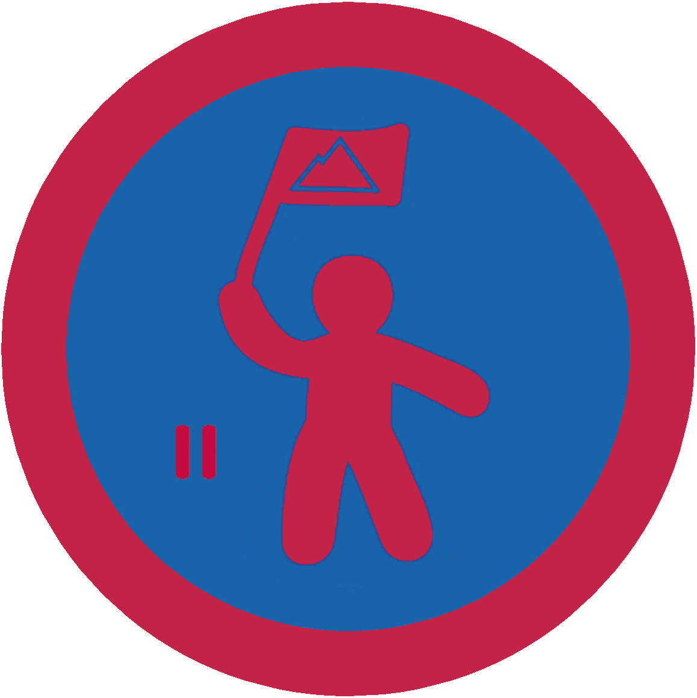

# Провідництво II - ІІІ проба

## Спеціалізація

Загальні вмілості

## Статус

Затверджена

## Останнє оновлення інформації вмілості

2020-07-23T15:21:06.713Z

## Рівень вмілості

3 проба

## Відзначка

## Вимоги до юнацтва

<ol><li>
Здобуде вмілість "Провідництво I";
</li><li>
Проведе гутірку про провідництво/лідерство та командоутворення на таборі чи вишколі;
</li><li>
Очолить проєкт станичного або крайового рівня та добре зорганізує командну роботу в ньому;
</li><li>
Відповідальний за провідне діловедення на курінному або окружному таборі (бунчужний, заступник коменданта з програми, скарбник, писар, інтендант);
</li><li>
Допоможе одному з членів гуртка/команди подолати виклик, що постав при виконанні завдання в проєкті;
</li><li>
Буде наставником для одного з юнаків куреня/станиці допоможе йому здобути вмілість "Провідництво І".
</li></ol>

## Вимоги до інструкторів

Інструктор повинен бути ознайомлений із рекомендаціями здачі вмілості, вміє пояснити матеріал для здачі вмілості, розуміє важливість лідерства в Пласті. Інструктор повинен мати досвід в організації проєктів у ролі координатора чи іншій керівній ролі. По можливості пройти кваліфікаційні курси, тренінги або вишколи.

## Код на badgecraft.eu

