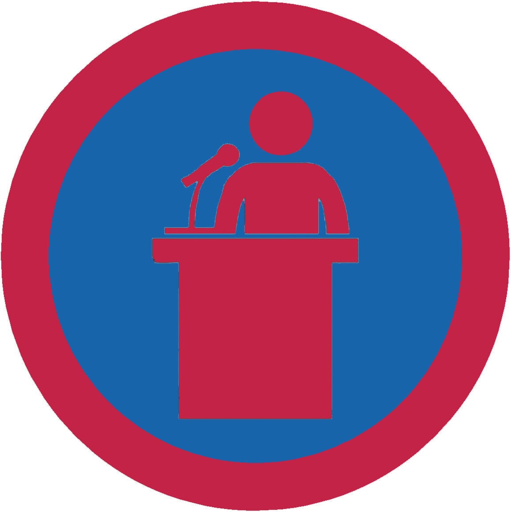

# Публічні виступи - ІІ проба

## Спеціалізація

Загальні вмілості

## Статус

Затверджена

## Останнє оновлення інформації вмілості

2020-05-03T08:01:30.955Z

## Рівень вмілості

2 проба

## Відзначка

## Вимоги до юнацтва

  1.&nbsp;&nbsp;&nbsp;
Влаштуй 3-5 хв. виступ-представлення себе
перед аудиторією (гурток, курінь, клас, і т.п.). 2.&nbsp;&nbsp;&nbsp;
Візьми участь у дебатах будь-якого формату (наприклад
Карла Поппера, відкритих, політичних, модель ООН чи інших). 3.&nbsp;&nbsp;&nbsp;
Влаштуй імпровізовану розповідь, принаймні
на 2 хв, на тему задану виховником, яка є цікавою для тебе, але без часу на
підготовку. 4.&nbsp;&nbsp;&nbsp;
Вибери тему, яка є цікавою для твоєї
аудиторії. Збери і систематизуй інформацію по цій темі і підготуй план. Склади
8-10 хв. доповідь, попрактикуйся доповідати і виголоси її. 5.&nbsp;&nbsp;&nbsp;
Продемонструй знання парламентської
процедури, будучи головуючим на зустрічі, у відповідності з прийнятими
правилами порядку, або відповідаючи на питання про ці правила порядку. 6.&nbsp;&nbsp;&nbsp;
Підготуй і проведи гутірку для свого гуртка
чи іншої аудиторії на ОДНУ з тем: -&nbsp;&nbsp;&nbsp;&nbsp;&nbsp;&nbsp;
"Як побороти страх перед
публічним виступом" -&nbsp;&nbsp;&nbsp;&nbsp;&nbsp;&nbsp;
"невербальне спілкування
під час публічних виступів"

## Вимоги до інструкторів

Даний розділ ще не є заповнений інформацією!

## Код на badgecraft.eu

