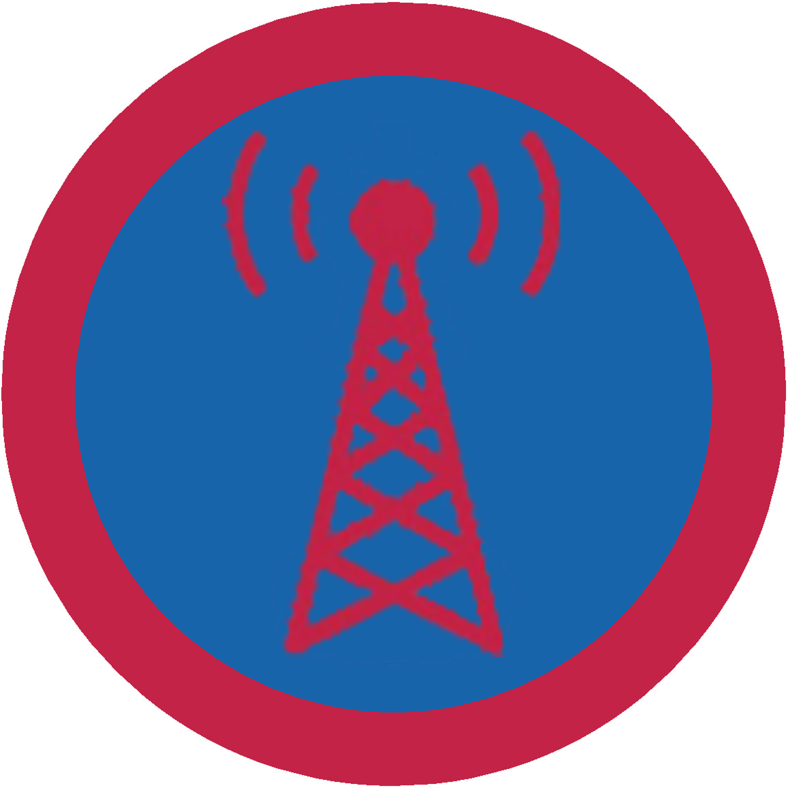

# Радіоаматор І проба

## Спеціалізація

Загальні вмілості

## Статус

Затверджена

## Останнє оновлення інформації вмілості

2020-07-20T17:09:03.475Z

## Рівень вмілості

1 проба

## Відзначка

## Вимоги до юнацтва

1.&nbsp;Проведе гутірку "Радіозв'язок", розповість про наступне:

&nbsp; &nbsp; ●&nbsp;історію виникнення радіозв’язку;

&nbsp; &nbsp;&nbsp;●&nbsp;відмінності між радіомовленням та радіо хобі;

&nbsp; &nbsp;&nbsp;●&nbsp;відмінності між передачею радіомовлення та двостороннім зв’язком;

&nbsp; &nbsp;&nbsp;●&nbsp;радіопозивні та спосіб їх використання в радіомовленні, аматорському радіо.

2.&nbsp;Знає які існують види радіостанцій, розповість коротко про них (професійні, радіоаматорські, цивільного використання).

3.&nbsp;Знає з яких частин складається радіостанція. Пояснить заходи безпеки при роботі з радіо обладнанням.

4.&nbsp;Розуміє поняття "радіохвиля", знає фізичні властивості радіохвиль та спосіб їх поширення.

5. Проведе та продемонструє застосування радіозв’язку на частотах LPD, PMR, CB ( 443 мГц, 446 мГц, 27 мГц ).

## Вимоги до інструкторів

Інструкторами даної вмілості можуть бути радіоаматори з відповідною ліцензією, випускники радіотехнічних факультетів, особи які професійно займаються радіоелектронікою або радіозв’язком, викладачі університетів.

## Код на badgecraft.eu

