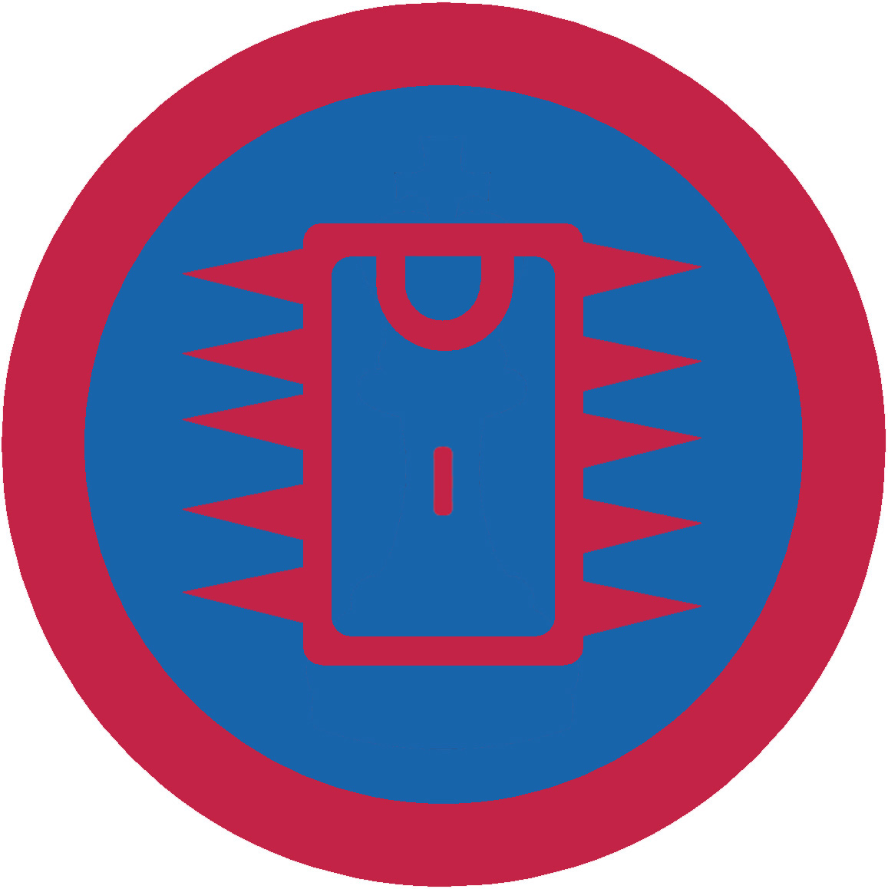

# Радіотехніка І

## Спеціалізація

Загальні вмілості

## Статус

Затверджена

## Останнє оновлення інформації вмілості

2020-05-03T07:59:44.213Z

## Рівень вмілості

1 проба

## Відзначка

## Вимоги до юнацтва

 <ol><li>Пояснити правила техніки безпеки при користуванні радіотехнічними приладами і їхніми комплектуючими.</li><li>Знати історію виникнення радіо.</li><li>Накреслити схему найпростішого радіоприймача.</li><li>Знати умовні позначення радіодеталей (резистор, транзистор, діод, змінний резистор, світлодіод, мікросхема, лампа, трансформатор, джерело живлення).</li><li>Знати, що таке паяльник, пояснити його будову, знати види паяльників.</li><li>Пояснити призначення каніфолі та припою.</li><li>Читати літературу чи електронні джерела з радіотехніки.</li></ol>   код на badgecraft.eu: upu_radiotech1 

## Вимоги до інструкторів

Даний розділ ще не є заповнений інформацією!

## Код на badgecraft.eu

upu_radiotech1