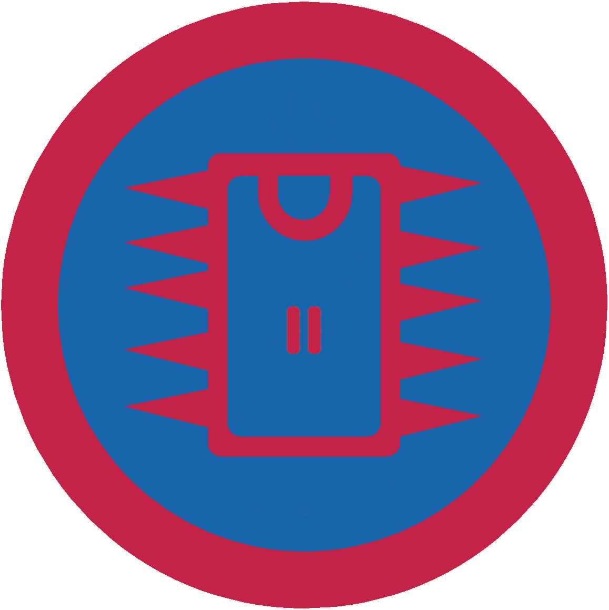

# Радіотехніка ІІ

## Спеціалізація

Загальні вмілості

## Статус

Затверджена

## Останнє оновлення інформації вмілості

2020-04-29T05:56:44.642Z

## Рівень вмілості

2 проба

## Відзначка

## Вимоги до юнацтва

  <ol><li>Знати і пояснити функцію, будову (в загальному) та застосування таких радіодеталей:</li></ol>- резистор; - конденсатор; - діод; - транзистор; - трансформатор. &nbsp; &nbsp; &nbsp;2. Знати будову і пояснити дію електродинамічної головки. &nbsp; &nbsp; &nbsp;3. Знати, які є типи мікрофонів. Схарактеризувати декілька з них. Пояснити відмінність та сфери застосування. &nbsp; &nbsp; &nbsp;4. Знати та вміти користуватись найпростішими приладами діагностування &nbsp; &nbsp; &nbsp;5. Розповісти алгоритм дій при створюванні приладу. Звернути увагу на запаювання мікросхем і транзисторів &nbsp; &nbsp; &nbsp;6. Вміти розробляти друковані плати &nbsp; &nbsp; &nbsp;7. Сконструювати мультигенератор за схемою      upu_radiotech2 

## Вимоги до інструкторів

Даний розділ ще не є заповнений інформацією!

## Код на badgecraft.eu

