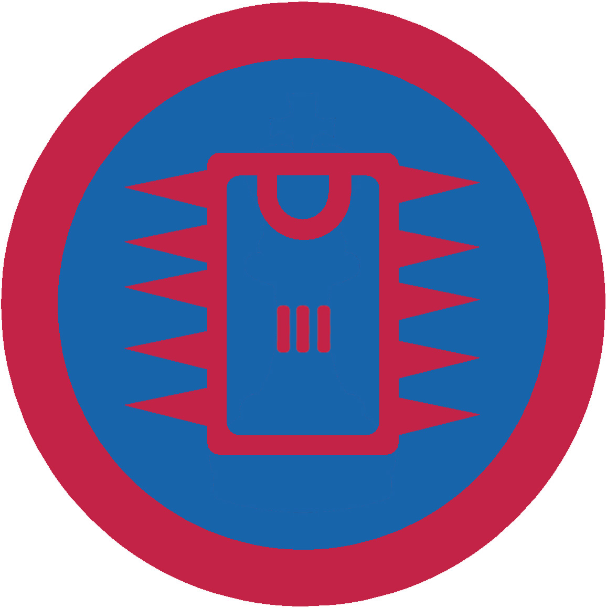

# Радіотехніка ІІІ

## Спеціалізація

Загальні вмілості

## Статус

Затверджена

## Останнє оновлення інформації вмілості

2020-04-29T09:11:04.214Z

## Рівень вмілості

3 проба

## Відзначка

## Вимоги до юнацтва

 <ol><li>Провести гутірку, пов’язану з радіотехнікою.</li><li>Організувати екскурсію на короткохвильову радіоаматорську колективну радіостанцію.</li><li>Сконструювати прилад з однією мікросхемою, продемонструвати його дію.</li></ol>    код на badgecraft.eu: upu_radiotech3  

## Вимоги до інструкторів

Даний розділ ще не є заповнений інформацією!

## Код на badgecraft.eu

upu_radiotech3