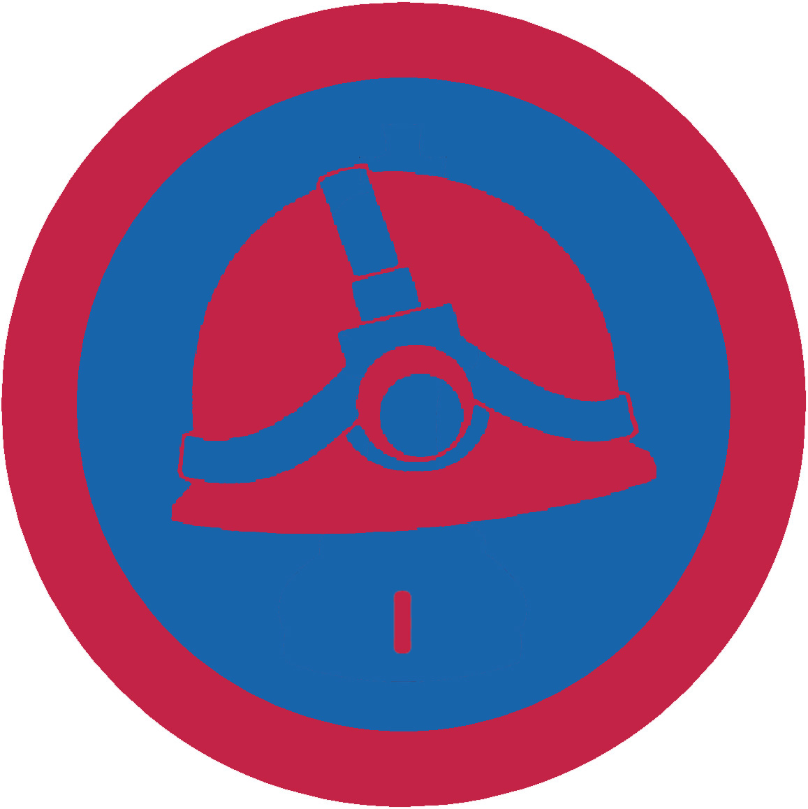

# Спелеотуризм І проба

## Спеціалізація

Загальні вмілості

## Статус

Затверджена

## Останнє оновлення інформації вмілості

2017-03-25T14:53:05.759Z

## Рівень вмілості

1 проба

## Відзначка

## Вимоги до юнацтва

 
1.&nbsp;&nbsp;&nbsp;&nbsp;&nbsp; Розказати, що таке спелеологія, коротку історію її
виникнення. Назвати відомих спелеологів світу, України, чим вони прославилися.

2.&nbsp;&nbsp;&nbsp;&nbsp;&nbsp; Що таке печери, як вони утворююється?

3.&nbsp;&nbsp;&nbsp;&nbsp;&nbsp; Пояснити на які види за способом утворення поділяються
печери, які між ними відмінності.

4.&nbsp;&nbsp;&nbsp;&nbsp;&nbsp; Назвати найбільші печери своєї області, України,
світу. Детально розказати про 3 печери України, назвати їх основні
характеристики.

5.&nbsp;&nbsp;&nbsp;&nbsp;&nbsp; Знати, який особистий виряд потрібен для
екскурісії в печері горизонтальній, вертикальній, пояснити потребу кожної речі.

6.&nbsp;&nbsp;&nbsp;&nbsp;&nbsp; Розказати правила перебування в печері, знати яка
максимальна кількість осіб повинна бути у екскурсійній групі та чому саме.

7.&nbsp;&nbsp;&nbsp;&nbsp;&nbsp; Здобути вмілість ПМД. Пояснити як слід поводитися
в надзвичайних ситуаціях (нещасних випадках) під землею

8.&nbsp;&nbsp;&nbsp;&nbsp;&nbsp; Відбути одну екскурсію в печери з протяжністю не
менше 2 км.

## Вимоги до інструкторів

Даний розділ ще не є заповнений інформацією!

## Код на badgecraft.eu

