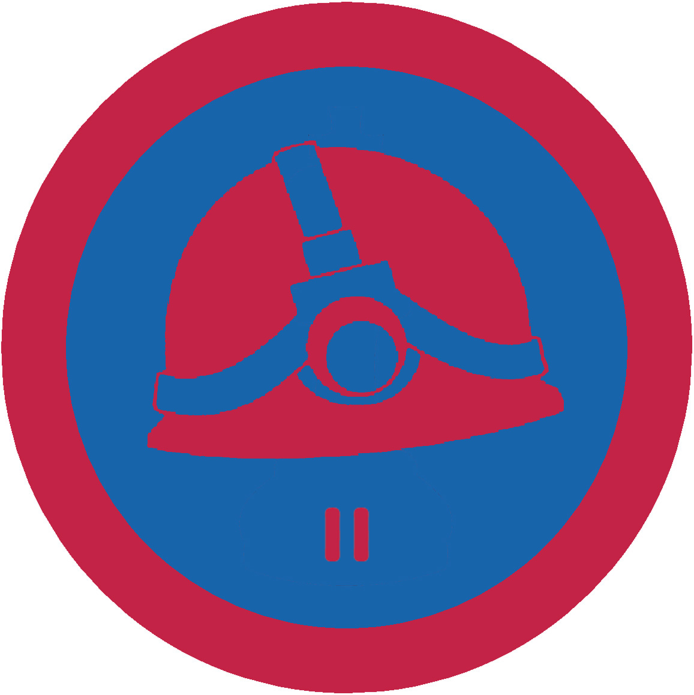

# Спелеотуризм ІІ

## Спеціалізація

Загальні вмілості

## Статус

Затверджена

## Останнє оновлення інформації вмілості

2020-05-03T08:05:18.181Z

## Рівень вмілості

2 проба

## Відзначка

## Вимоги до юнацтва

 <ol>
 <li>Здобути вмілісь Спелеотуризм І.</li>
 <li>Знати про найбільші горизонтальні та
     вертикальні печери світу, назвати по 3 з них, розказати їх основні характеристики.</li>
 <li>Особливості пересування
     в печерах, долання перешкод.</li>
 <li>Орієнтування під
     землею, засоби та методи.</li>
 <li>Відбути мінімум 3
     різних&nbsp; екскурсії з різними
     маршрутами в печерах, протяжністю не менше 8 км.</li>
 <li>Відбути спелеологічний
     вишкіл учасником тривалістю не менше як 3 дні та перейти його з
     результатом не гірше як добре.</li>
 <li>Організувати одну
     екскурсію в печери для гуртка чи куреня.</li>
</ol>

## Вимоги до інструкторів

Даний розділ ще не є заповнений інформацією!

## Код на badgecraft.eu

