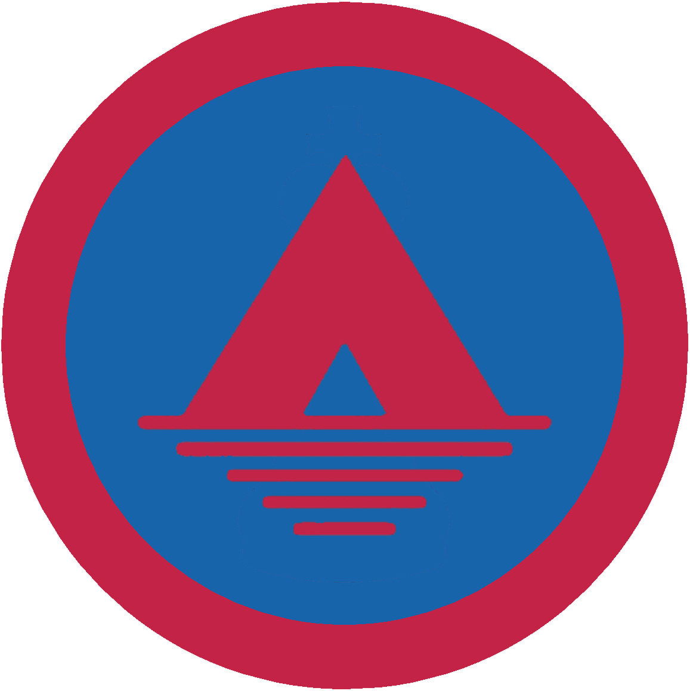

# Табірництво - І проба

## Спеціалізація

Загальні вмілості

## Статус

Затверджена

## Останнє оновлення інформації вмілості

2020-05-03T07:41:08.043Z

## Рівень вмілості

1 проба

## Відзначка

## Вимоги до юнацтва

 1.Мати власний таборовий виряд та пояснити потребу
кожної речі. 

2.Відбути хоча б два тижні пластового таборування під
шатрами.

3.Докладно пояснити:

а) як підібрати догідне для таборування місце;

б) що належить до таборового гурткового або курінного
виряду, а що до особистого;

в) способи ставлення шатер на таборі;

г) забезпечення табору від вогню;

д) потребу дотримання чистоти на таборі.

4.Виконати щонайменше п'ть з перелічених таборових
робіт: стояк на менашки, стояк на черевики, стояк на ручпники, ліжко (прича),
вішак на одяг, полицю в шатрі, лавку, східці, прикрасу біля щогли або шатра.

5.Спільно зі своїм гуртком поставити хоча б двоособове шатро
та забезпечити його від негоди.

6.Взяти активну участь в будові щонайменше двох з таких
таборових споруд: машта або морська щогла, брама, лятрина, польовий стіл.

7.Підготувати місце на ватру,
збудувати таборову ватру одного виду, розпалити вогонь, загасити ватру та
упорядкувати використане місце.    код на badgecraft.eu: upu_tabir 

## Вимоги до інструкторів

Даний розділ ще не є заповнений інформацією!

## Код на badgecraft.eu

upu_tabir