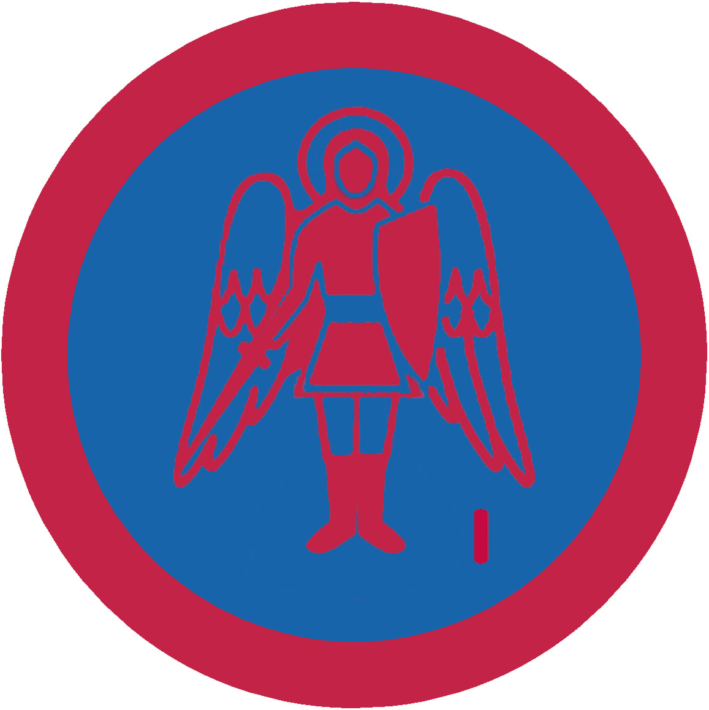

# Український амбасадор І

## Спеціалізація

Загальні вмілості

## Статус

Затверджена

## Останнє оновлення інформації вмілості

2020-05-03T07:44:34.970Z

## Рівень вмілості

1 проба

## Відзначка

## Вимоги до юнацтва

  

1. Вибрати будь-яку існуючу іноземну державу і на п’яти аркушах
описати історію, державний устрій, побут, звичаї і традиції її суспільства. На
основі написаного виховник протягом тижня складає тест з 10 питань, який
пропонує до вирішення претенденту. 

2. Продемонструвати свої знання музичної, літературної, мистецької
спадщини даного народу (виконати дві народні пісні мовою оригіналу; досконало
знати відомих митців країни, які зробили значний внесок у загальноєвропейську
чи світову культуру).    код на badgecraft.eu: upu_ukrambas1 

## Вимоги до інструкторів

Даний розділ ще не є заповнений інформацією!

## Код на badgecraft.eu

upu_ukrambas1