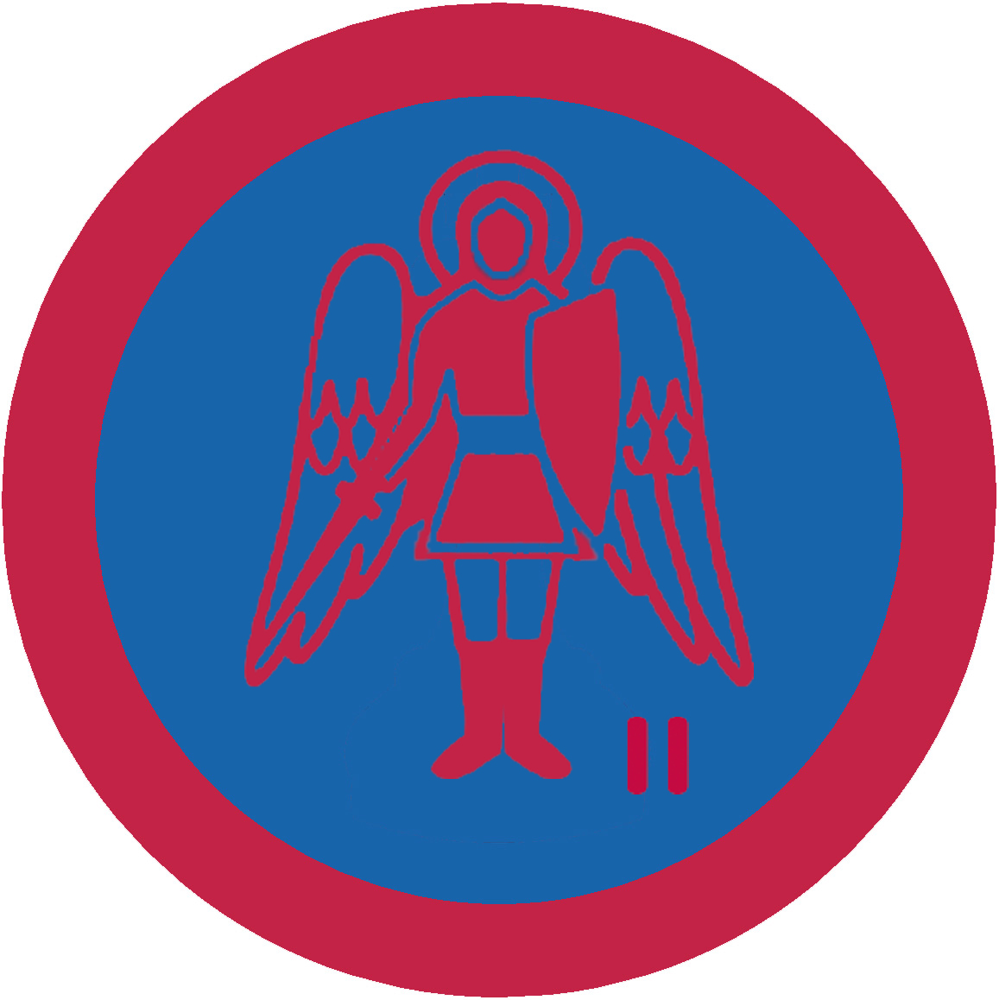

# Український амбасадор ІІ

## Спеціалізація

Загальні вмілості

## Статус

Затверджена

## Останнє оновлення інформації вмілості

2020-05-03T08:03:07.030Z

## Рівень вмілості

2 проба

## Відзначка

## Вимоги до юнацтва

 Вигадати якусь абстрактну державу Х і написати на 5 аркушах
твір-розповідь про неї за таким планом-схемою: 

1. Виникнення і розбудова держави (вигадана загальна історія
держави X).

2. Держаний устрій, органи управління, які здійснюють судову,
виконавчо-розпорядчу і законодавчу владу.

3. Звичаї і традиції держави X.

4. Вигадати одну історичну думу, баладу про національного героя цієї
країни. На основі твору-розповіді виховник протягом тижня складає тест з 10
питань і пропонує до вирішення претенденту.    код на badgecraft.eu: upu_ukrambas2 

## Вимоги до інструкторів

Даний розділ ще не є заповнений інформацією!

## Код на badgecraft.eu

upu_ukrambas2