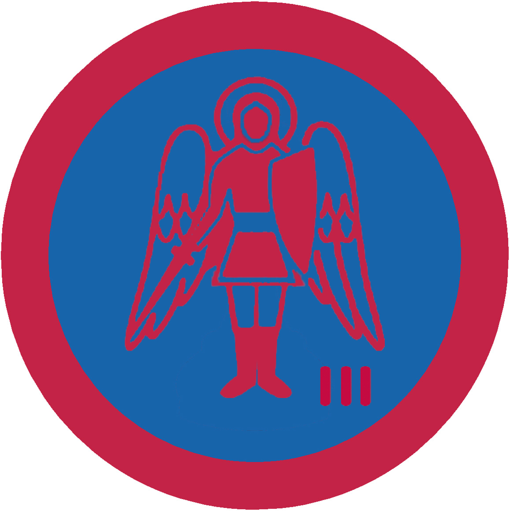

# Український амбасадор ІІІ

## Спеціалізація

Загальні вмілості

## Статус

Затверджена

## Останнє оновлення інформації вмілості

2020-05-03T07:39:13.897Z

## Рівень вмілості

3 проба

## Відзначка

## Вимоги до юнацтва

 Підготувати три дослідницькі статті (різними
іноземними мовами) про сучасний політико-економічний стан трьох іноземних
держав і виступити з ними перед заздалегідь попередженою про тему виступу
аудиторією (напр., куренем чи самостійним гуртком). Після того курінь чи
самостійний гурток влаштовують претенденту 20-хвилинну пресконференцію, на
основі якої компетентна комісія підтверджує чи заперечує виконання вимог
вмілості.    код на badgecraft.eu: upu_ukrambas3 

## Вимоги до інструкторів

Даний розділ ще не є заповнений інформацією!

## Код на badgecraft.eu

upu_ukrambas3