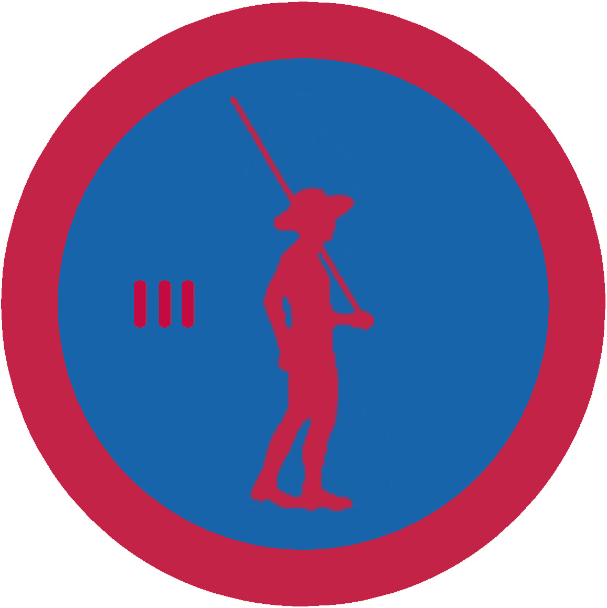

# Впоряд ІІІ

## Спеціалізація

Загальні вмілості

## Статус

Затверджена

## Останнє оновлення інформації вмілості

2020-07-13T15:28:47.750Z

## Рівень вмілості

3 проба

## Відзначка

## Вимоги до юнацтва

Виконати А або Б

А. 1. Здобути вмілість "Впоряд ІІ"

2. Відбути станичний захід або будь-який табір на посаді бунчужного/ої.

3. Виконати принаймні одне із завдань:

- Організувати і провести вишкіл впоряду для куреня (повинно бути не менше 20-ти учасників) та подати творчий звіт до Крайової рьеферентури Почесної Варти.

- Організувати дефіляду з гуртком чи куренем та подати творчий звіт до Крайової референтури Почесної Варти.

- Провести церемоніальний захід в курені (Наприклад, покладання вінків до могили/пам'ятника визначній особі/патронові куреня; вимарш у честь

особливої події; урочисте надання курінних відзначень/нагород) та подати творчий звіт до Крайової референтури Почесної Варти.

 Б. Пройти вишкіл "Почесна варта" з вислідом не нижче за "дуже добре".

## Вимоги до інструкторів

Даний розділ ще не є заповнений інформацією!

## Код на badgecraft.eu

