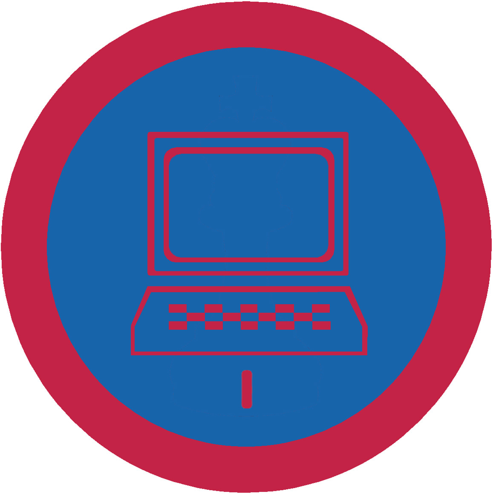

# Знавець комп&#39;ютерів І

## Спеціалізація

Загальні вмілості

## Статус

Затверджена

## Останнє оновлення інформації вмілості

2020-05-03T07:44:19.991Z

## Рівень вмілості

1 проба

## Відзначка

## Вимоги до юнацтва

 <ol><li>
Вміти правильно увімкнути та вимкнути комп’ютер; розказати про основні заходи безпеки при роботі з ним.
</li><li>
Знати, з яких основних частин складається комп’ютер. Вміти правильно підключити всі елементи комп’ютера.
</li><li>
Пояснити принцип роботи комп’ютера та взаємодію різних частин апаратного забезпечення комп’ютера.
</li><li>
Виконати найпростіші дії в роботі з комп’ютером, наприклад: – написати текст в текстовому редакторі, – використовуючи електронні таблиці, виконати просту операцію, наприклад, сумування комірок, – написати та переслати лист електронною поштою.
</li><li>
Заінсталювати в комп’ютері нову програму і налаштувати її для власних потреб.
</li><li>
Розповісти про основні етапи розвитку комп’ютерів.
</li></ol>
   код на badgecraft.eu: upu_znavcomp1 

## Вимоги до інструкторів

Даний розділ ще не є заповнений інформацією!

## Код на badgecraft.eu

upu_znavcomp1