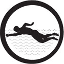

# плавання 3

## Спеціалізація

Морська

## Статус

Затверджена

## Останнє оновлення інформації вмілості

2016-06-14T05:23:26.579Z

## Рівень вмілості

3 проба

## Відзначка

## Вимоги до юнацтва

1. Вичислить правила безпеки та здоров’я при плаванні. 2. Скочить у воду на ноги, та на голову (якщо можливо й безпечно) з дошки і з берега. 3. Під водою пропливе 25 метрів і вдержиться 15 секунд. 4. Вдержиться на воді, у вертикальній позиції, з допомогою ніг і рук 10 хвилин, а одну хвилину 15 секунд з руками над водою. 5. Витягне цеглу (або інший тяжкий предмет) з принайменше 8 стіп глибини в басейні і притягне до берега 2 метри. 6. Пропливе в одежі 25 метрів і тоді роздягнеться у воді (штани, сорочка, скарпетки, сандали чи тенісівки) 7. Пропливе 4-ма стилями плавання: 100 м на спині, 100 м кравлем, 100 м жабкою, 25 метеликом 8. Пропливе довільним стилем 500 м.9. Продемонструє вжиток сорочки, весла або іншого предмету для рятування потопаючого.

## Вимоги до інструкторів

Абсольвент ВКПМП &nbsp;та посвідка державного зразка будь-якого рівня у відповідній ділянці

## Код на badgecraft.eu

